Sylve 是一個運行在 FreeBSD 上的新興虛擬化、容器、ZFS存儲管理平臺。  
也許能同時實現 PVE、TrueNAS、OpenWrt 的功能，讓 All in Boom 的集成度更上一層？

本文就是從 PVE + TrueNAS SCALE 跑路到 Sylve，並連續使用一個半月後的體驗文。

:::note
這是一篇人類寫的體驗文，寫作過程中 AI 含量為 0%。  
:::


## 0.界面

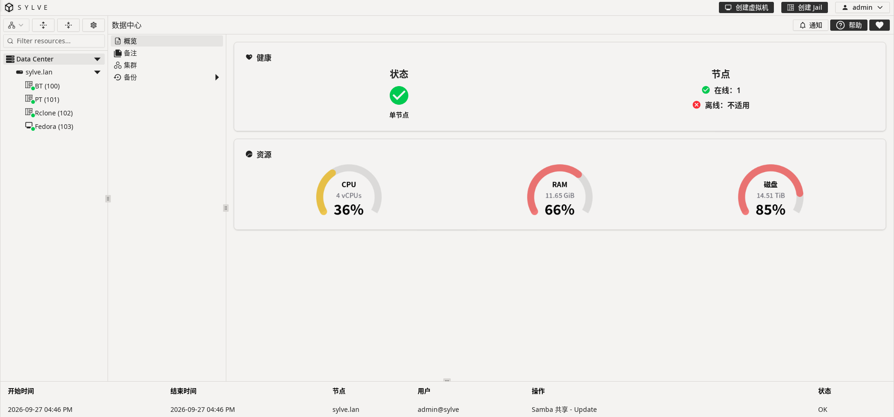

風格與 PVE 極度相似，幾乎是照著描出來的，但觀感和動畫效果比 PVE 的體驗更好。

自帶中文，但是中文翻譯的人類含量並不高，比如```Trim```會翻譯成```修剪```。  
儘管如此，翻譯質量還是要比 TrueNAS CORE 的機翻要好得多。

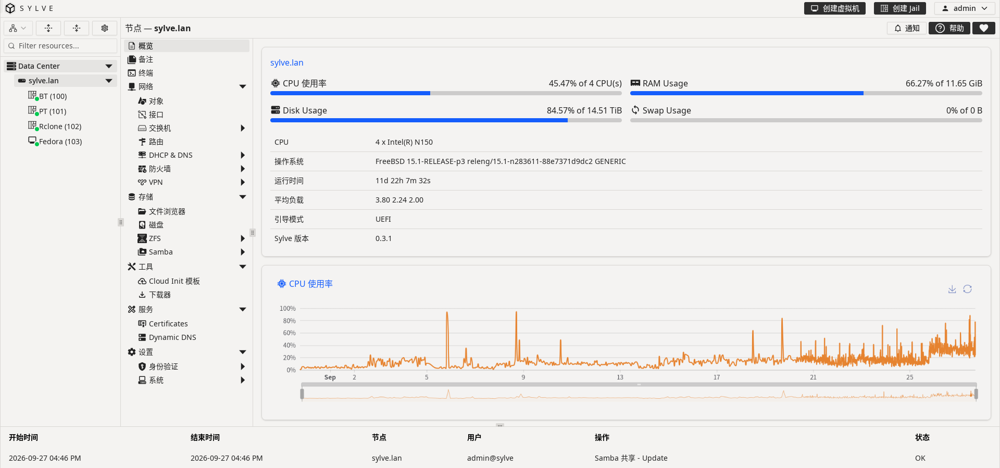

:::warning
界面設置成中文時，部分設置項無法保存，算是一個嚴重 BUG。  
現階段還是建議日常使用英文，中文界面僅用於幫助初期上手理解。
:::


## 1.替代 PVE？
道阻且長。


### 1.1 穩定性
PVE 基於 Debian，而 Sylve 基於 FreeBSD，硬要說的話，FreeBSD 的代碼質量更高，可能更穩定，但邊際效益並不明顯。

由於近期的 AI 把矛頭對準了 Linux，接連不斷曝出高危漏洞；而 FreeBSD 的注目度相對較低。

因此在目前時點，出於私心，我認為 Sylve 的穩定性略優於 PVE。


### 1.2 容器
FreeBSD 的 Jail 在功能性上是完全對標 Linux LXC 的，但輸在了沒有像 Docker 一樣豐富的社區資源和簡易化部署。

並且，現階段的 Sylve 的 Jail 部署體驗可能還比不上 TrueNAS CORE，基礎的目錄映射功能都要手寫參數。

比如，若是想把宿主機的
```/n150/nas/media```
映射進ID為```100```的 Jail 裡的
```/mnt```
的話，需要手動在
``` FSTab Entries```
寫一行參數。  
```/n150/nas/media /zroot/sylve/jails/100/mnt nullfs rw 0 0```

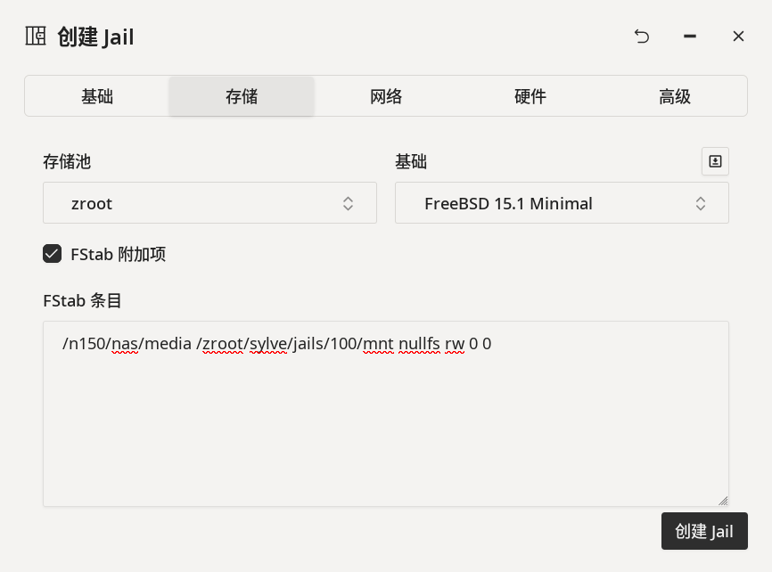

另外，還可以
[創建 Linux Jail](https://sylve.io/guides/one-shot-guides/rocky-linux-jail/)
（透過 Linux 兼容層），直接使用該 Linux 發行版的包管理器安裝軟件，並且性能幾乎接近原生。  
但畢竟不是真正的 Linux，要是遇到了需要調用內核功能、```systemd```的軟件（比如 Docker）的話，是運行不了的，評價為聊勝於無。

官方文檔還演示了如何[創建一個運行 Plasma 桌面環境的 Jail](https://sylve.io/guides/one-shot-guides/kde-desktop-jail/)，並把畫面通過 XRDP 共享出來，有需要的話可以參考。


### 1.3 虛擬化

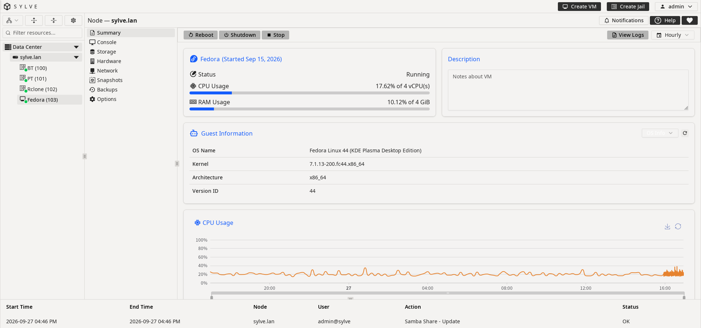

#### 1.3.1 硬件直通
先說最關心的點，Sylve 支持包括 GPU 在內的硬件直通，並且全程可在 UI 上配置。

這一點比 PVE 要好，因為 PVE 想要直通顯卡的話：  
先得修改```/etc/default/grub```開啟```IOMMU```；  
再修改```/etc/modules```開啟```VFIO```；  
接著修改```/etc/modprobe.d/pve-blacklist.conf```屏蔽顯卡驅動。  
而這全都要用戶手動用命令行進行修改。

Sylve 的直通配置可謂是相當無腦，選擇立即將硬件從宿主系統分離，或是在下次啟動時分離。之後 Sylve 會幫你做好一切，不需要手動進命令行干預。

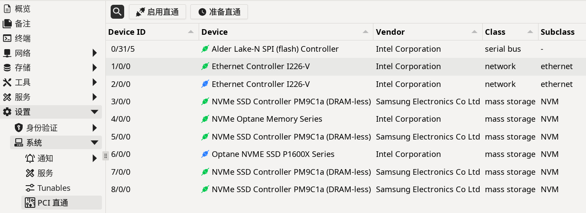
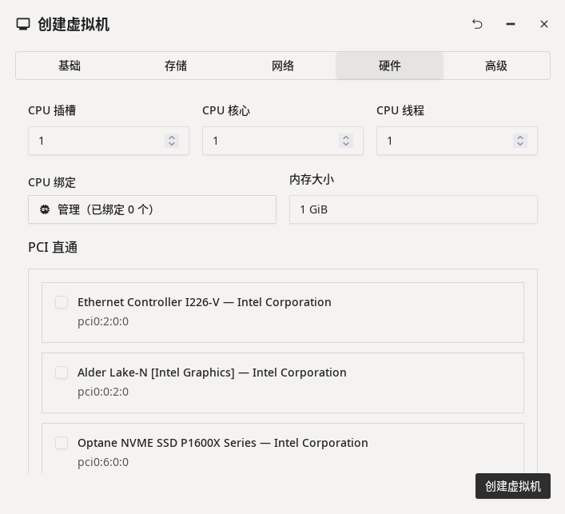

但致命的痛點在於，FreeBSD 不支持通過```SR-IOV```方式將 GPU 同時分配給多個虛擬機。

我自己試了下，嘗試將 Intel N150 的核顯完全直通給 Fedora 虛擬機，虛擬機內能識別到顯卡並能調用它進行3D加速、硬件編解碼視頻，但是 HDMI 接口並沒有顯示輸出，系統內提示```Unable to reuse host address of Graphics Stolen Memory```。  
我試了下手動指定```VBIOS```也無法解決，尚不清楚是我的配置問題還是 FreeBSD 的直通問題。

#### 1.3.2 網絡配置
不像 PVE，系統裝好就有默認配置好的網橋可以開箱即用。Sylve 是 FreeBSD 上的一個軟件包，它在安裝後不會也不應該去主動修改系統現有的網絡配置，因此如果想讓虛擬機以非直通的方式使用橋接、NAT網絡的話，需要手動在 UI 裡配置網橋。

UI 裡已經儘量做了簡化了，但對於不懂網絡基礎的人配置起來還是有困難的。


#### 1.3.3 顯示輸出
PVE 支持 SPICE，能傳送繪圖指令和剪切板；而 Sylve 只有 VNC，實現相關功能需要在虛擬機內部開啟 RDP 之類的服務，因此 PVE 完勝。


## 2.替代 TrueNAS CORE？
我個人認為是完全可以替代的。

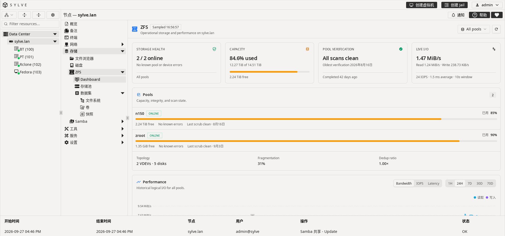


### 2.1 內存開銷
ARC 默認限制使用十分之一的物理內存，系統本體在完全啟動後的內存佔用和 PVE 差不多；而 TrueNAS 則是激進地把所有可用內存拿來當緩存，有需要時釋放。

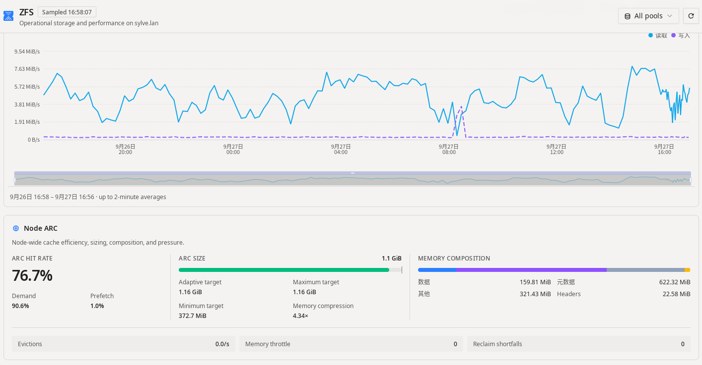


### 2.2 文件共享
目前支持```Samba```和```iSCSI```，
不支持```NFS```、```FTP```、```WebDAV```，
不過這對於個人 NAS 來說是完全沒有問題的。

```Samba```的用戶權限配置比 TrueNAS 要直觀易懂得多。
在```Authentication```->```Users```->```PAM```裡新建```Samba User```，
創建共享的時候只需要配置這個用戶權限是「只讀」還是「讀寫」就行了。

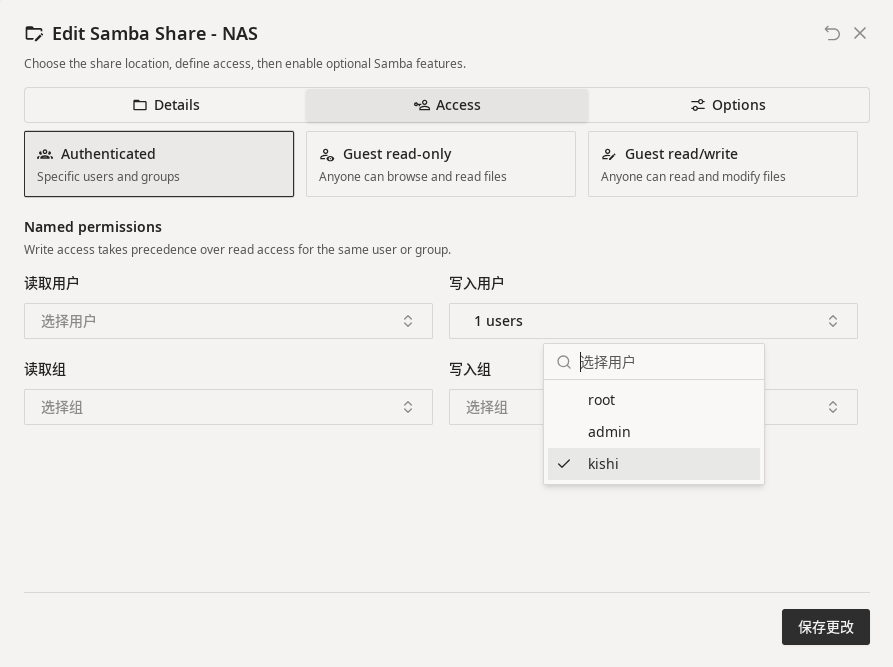

:::note
Sylve 的```Samba```的最小共享單位是「數據集」，無法共享數據集下的某個特定目錄。
:::


### 2.3 數據安全
支持手動和定時自動創建快照，但不支持跳過空快照，因此如果定時快照的時間間隔太短的話，快照倉庫裡會有一堆空快照，顯得眼花繚亂。

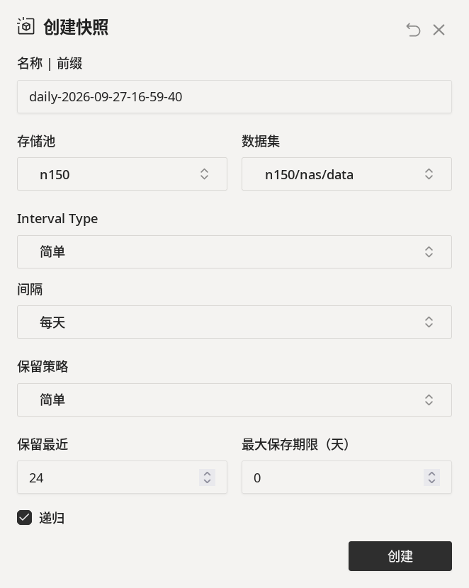

支持手動```Scrub```（數據校驗），不支持設置定時自動```Scrub```。


# 3.替代 OpenWrt？
也許可以。

這個設想我並未具體實行過，但 Sylve 內的相關組件是有這個潛力的。

只要 FreeBSD 本體通過```PPPoE```或者```DHCP```連上了網絡，
那麼完全可以通過 Sylve 自帶的：

| 組件 | 功能 |
| --- | --- |
| Switches | 設置子網、綁定網口 |
| Routes | 設置默認路由和 IPv6 |
| DHCP & DNS | 下發內網 IP、設置 DNS |
| Firewall | 設置 NAT 規則 |

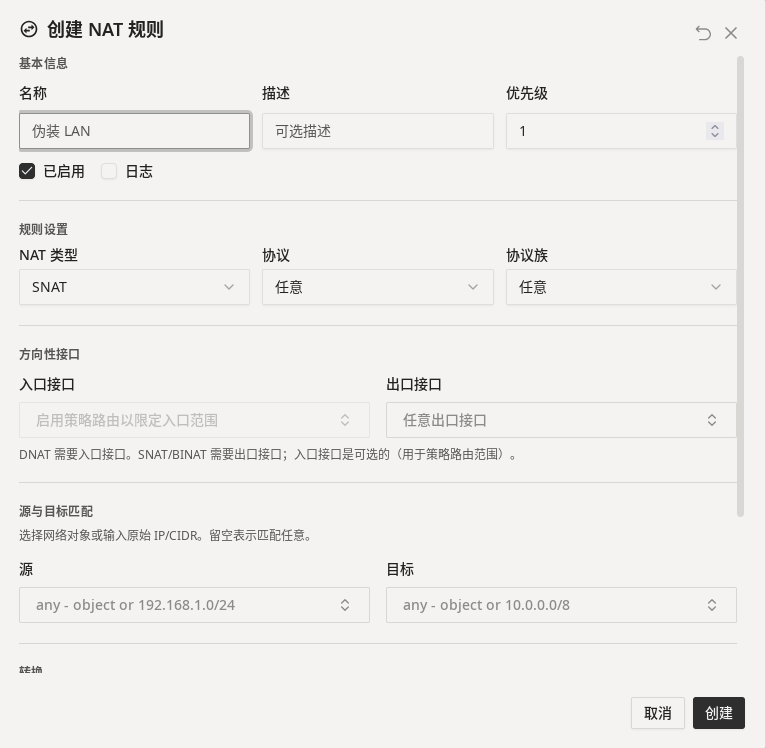

比起在 PVE 下裝 OpenWrt：  
你不再需要為 OpenWrt 劃分一塊死內存建立一個新虛擬機；  
不再需要給 OpenWrt 配置虛擬化網卡或者單獨直通一張直通網卡；  
並且可能還會有更快更穩定的網絡。  
（Netflix 的 CDN 服務器就是 FreeBSD。）

但代價是，這一切都得手動設置，而 OpenWrt 則可算是開箱即用。


## 4.其餘的一些坑


### 4.1 Sylve 登錄密碼
修改```/usr/local/etc/sylve/config.json```
並將```forcePasswordReset```的值設置為```true```，
這會讓 Sylve 在下次啟動時應用這個非空的配置密碼，隨後該字段會自動清除。


### 4.2 Intel N150 核顯驅動
FreeBSD 的顯卡驅動是從 Linux 移植過來的，
而現階段的 Intel N150 對於 FreeBSD 來說還相對較新，
安裝穩定版的```drm-kmod```會有報錯提示
```Got Intel graphics stolen memory base 0x0, size 0x0```，
需要安裝```drm-latest-kmod```才能正常驅動。

```
pkg install drm-latest-kmod gpu-firmware-intel-kmod-alderlake gpu-firmware-intel-kmod-tigerlake
kldload i915kms
```

```ls -l /dev/dri /dev/drm```  
驗證是否輸出```/dev/dri/renderD128```節點。

開機自啟：  
在```/etc/rc.conf```中追加
```kld_list="i915kms"```

:::caution
如果宿主系統已經安裝了顯卡驅動，又打算直通顯卡給虛擬機的話，
需要確保在```/etc/rc.conf```裡沒有```kld_list="i915kms"```，
否則開機會加載核顯，而系統又不到顯卡，導致內核崩潰。
:::


### 4.3 IPv6
在運營商下發了新的 IPv6 前綴後，FreeBSD（以及我的 Android 設備）會找不到默認路由。  
這個問題在3年前就已經存在了。  

我個人的解決辦法很暴力，路由器開啟 NAT66，這樣就可以寫死 FreeBSD 的 IP 和路由，任前綴怎麼變也影響不到內網的機器。

:::caution
確保路由器開啟了 NAT66 並把下面的子網、地址改成你自己的，配置不當會丟失連接！
:::

```vi /etc/rc.conf```

```
cloned_interfaces="bridge0"
ifconfig_bridge0_name="sylve-br"
ifconfig_sylve_br="inet 192.168.1.111 netmask 255.255.255.0 addm igc0 up"
ifconfig_igc0="up"

ifconfig_sylve_br_ipv6="inet6 auto_linklocal"
ifconfig_sylve_br_alias0="inet6 fd00::111 prefixlen 64"

defaultrouter="192.168.1.1"
ipv6_defaultrouter="fd00::1"
```

這是創建了一個網橋，綁定了```igc0```網卡，
並把```IPv4```地址和```IPv6```地址分別設置成了```192.168.1.111```和```fd00::111```，指向網關```192.168.1.1```和```fd00::1```。

之後在 Sylve 的```Switches```->```Manual```裡導入這個手動創建的網橋即可。
