All of the above is itended to test the UI and the rendering result of [Mermaid](https://mermaid.js.org) using [rehype-mermaid](https://github.com/remcohaszing/rehype-mermaid).

## Flowcharts

Doc: [https://mermaid.js.org/syntax/flowchart.html](https://mermaid.js.org/syntax/flowchart.html)

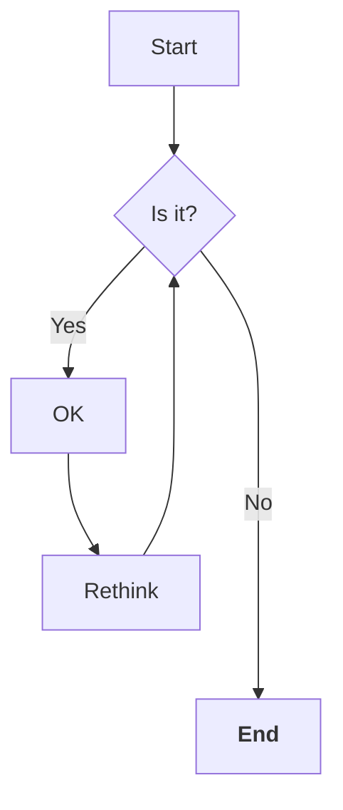

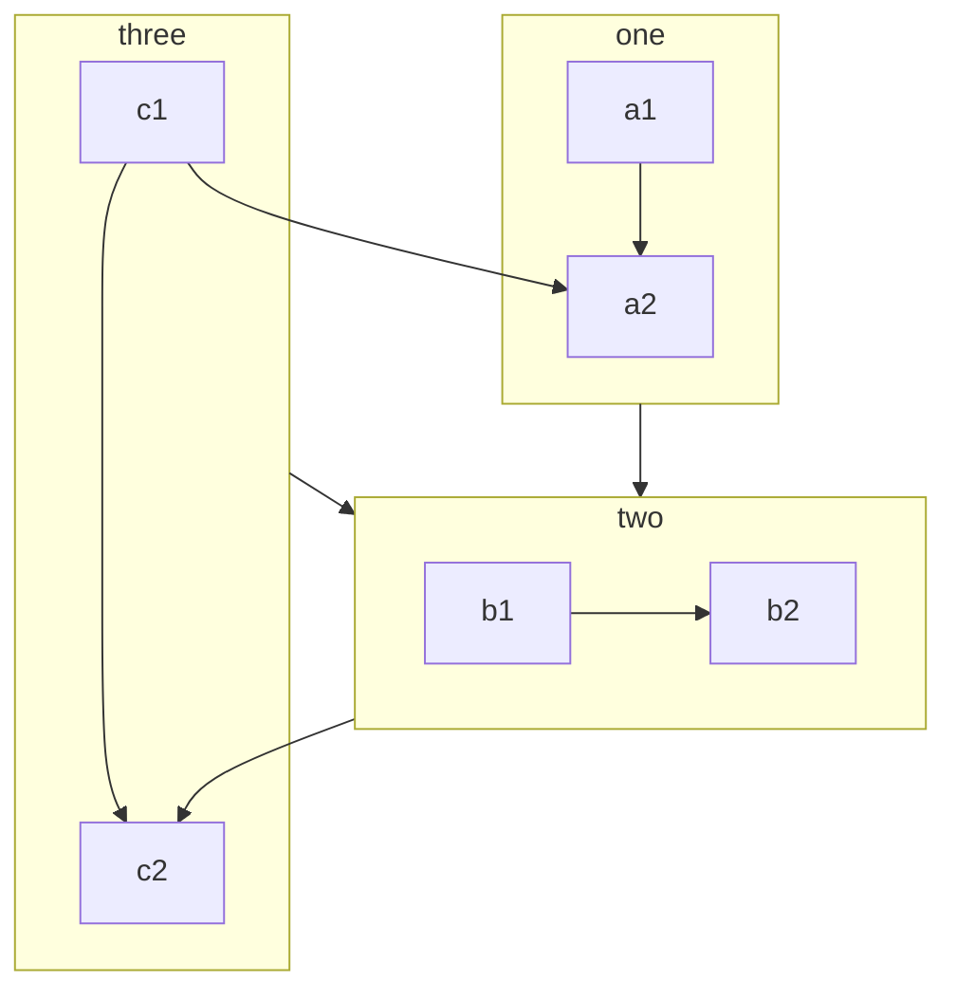

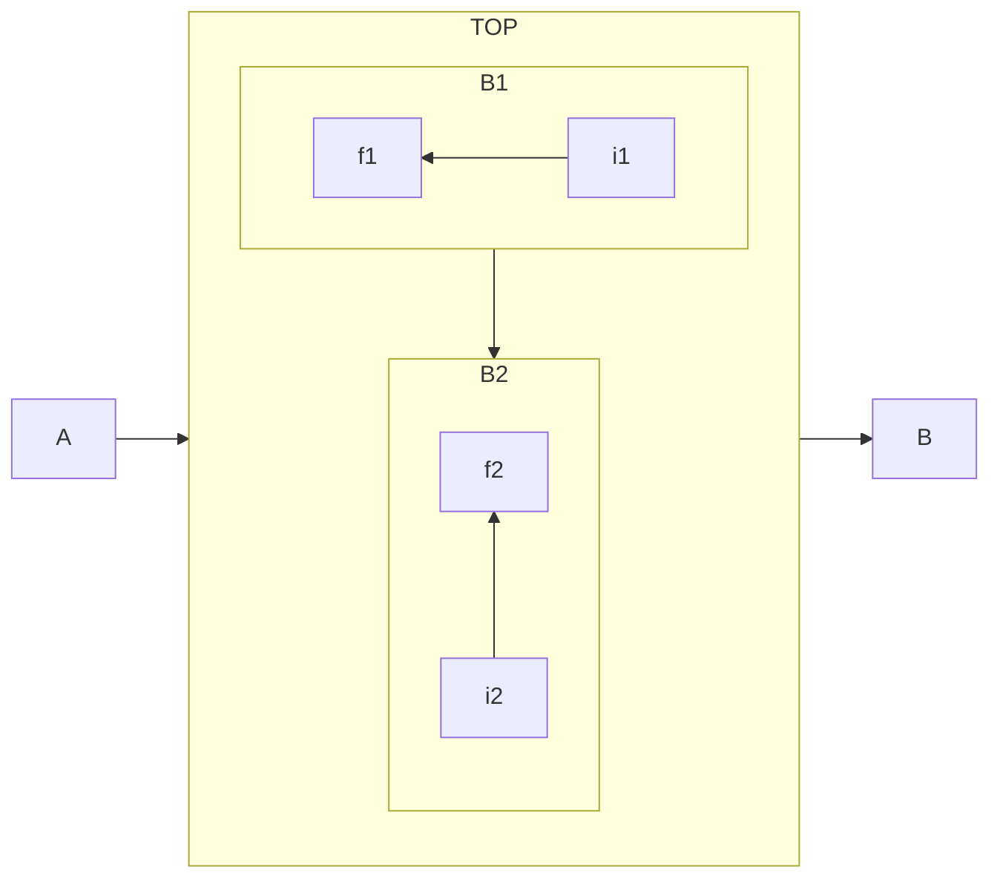

### Components

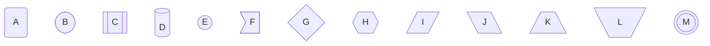

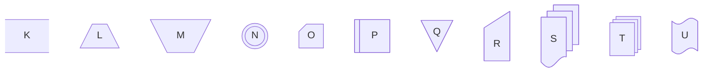

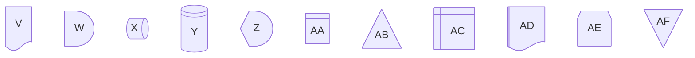

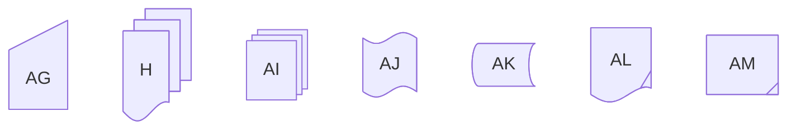

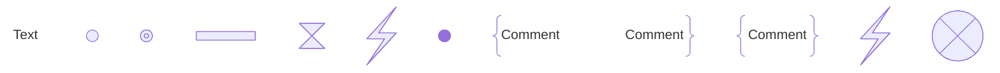

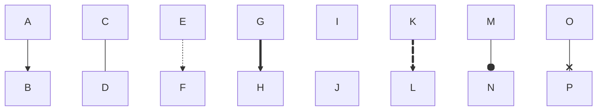

## Swimlanes Diagram

Doc: [https://mermaid.js.org/syntax/swimlanes.html](https://mermaid.js.org/syntax/swimlanes.html)

```mermaid
swimlane-beta LR
  subgraph Customer
    request[Request service]
    receive[Receive update]
  end

  subgraph Support
    triage[Triage request]
    answer[Send answer]
  end

  subgraph Engineering
    investigate[Investigate issue]
    fix[Prepare fix]
  end

  request --> triage
  triage -->|Known issue| answer
  triage -->|Needs code change| investigate
  investigate --> fix --> answer
  answer --> receive
```

```mermaid
swimlane-beta LR
  subgraph Intake
    start([Start])
    task[Do work]
    fix[Fix issues]
  end

  subgraph Review
    decision{Ready?}
  end

  subgraph Complete
    done((Done))
  end

  start --> task --> decision
  decision -->|Yes| done
  decision -->|No| fix
  fix --> task
```

```mermaid
swimlane-beta TB
  subgraph ops [Operations]
    intake[Receive request]
    plan[Plan work]
  end

  subgraph legal [Legal]
    review[Review contract]
  end

  intake --> plan --> review

  classDef attention fill:#fff2cc,stroke:#d6a500,color:#111;
  class review attention;
```

## Sequence Diagram

Doc: [https://mermaid.js.org/syntax/sequenceDiagram.html](https://mermaid.js.org/syntax/sequenceDiagram.html)

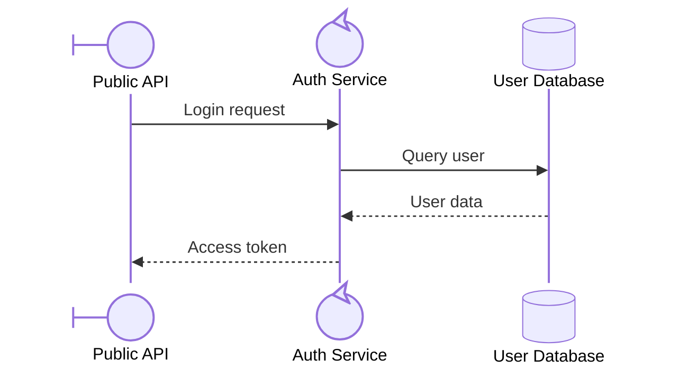

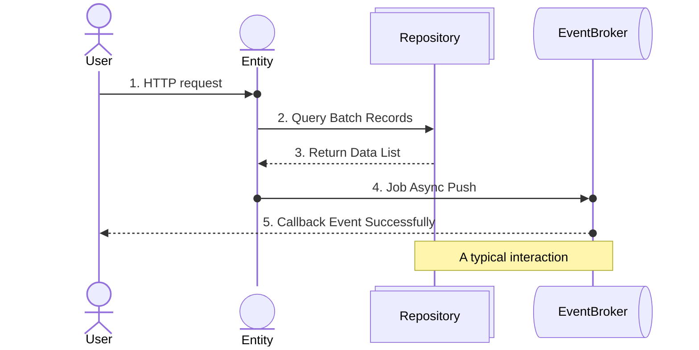

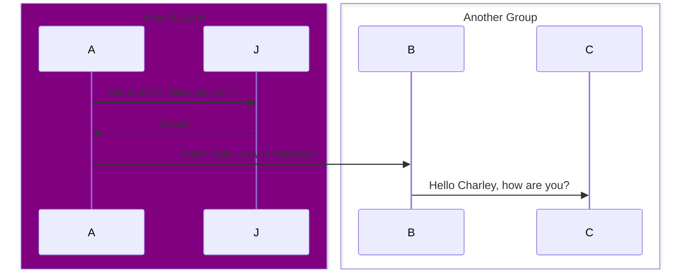

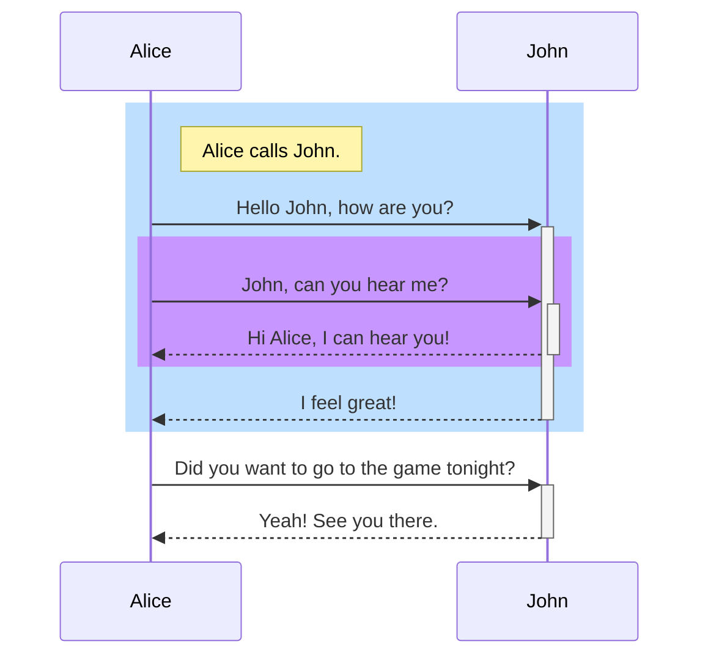

### Loop, Alt, Parallel, Critical, Break

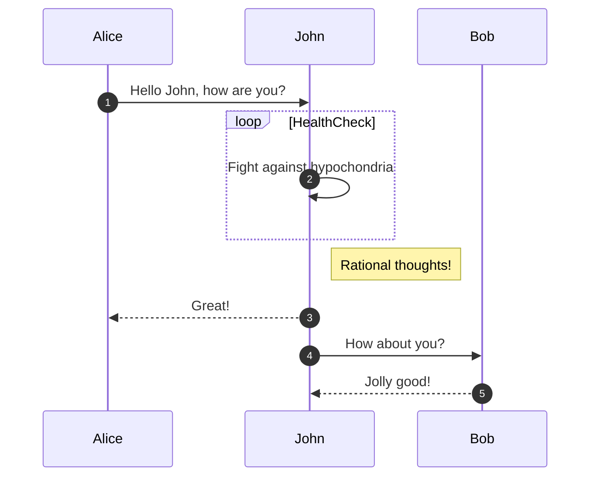

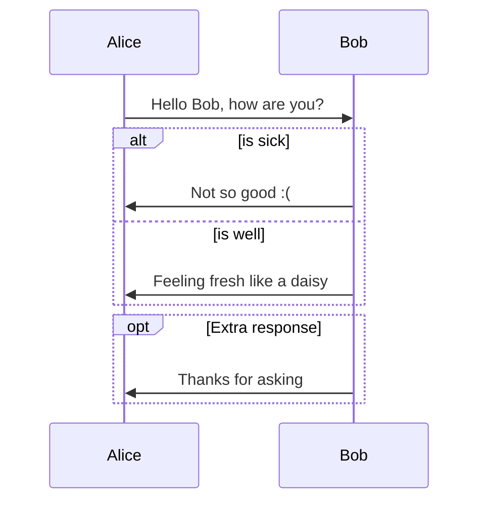

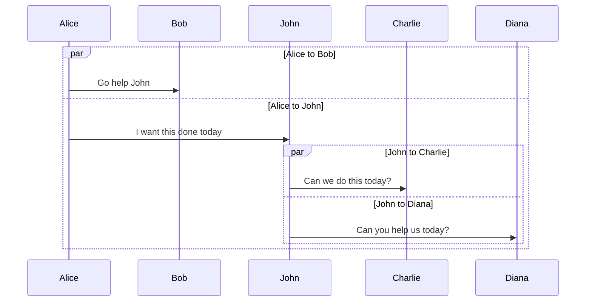

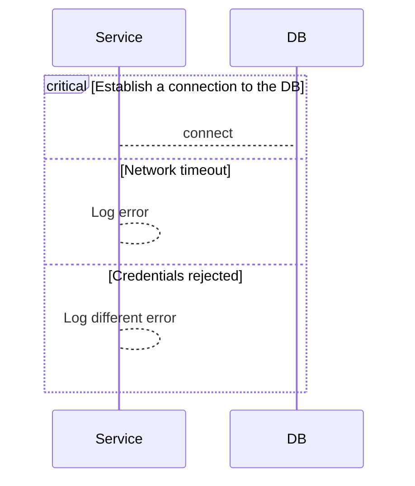

```mermaid
sequenceDiagram
  Consumer-->API: Book something
  API-->BookingService: Start booking process
  break when the booking process fails
    API-->Consumer: show failure
  end
  API-->BillingService: Start billing process
```

## Class Diagram

Doc: [https://mermaid.js.org/syntax/classDiagram.html](https://mermaid.js.org/syntax/classDiagram.html)

```mermaid
---
title: Animal example
---
classDiagram
  note "From Duck till Zebra"
  Animal <|-- Duck
  note for Duck "can fly<br>can swim<br>can dive<br>can help in debugging"
  Animal <|-- Fish
  Animal <|-- Zebra
  Animal : +int age
  Animal : +String gender
  Animal: +isMammal()
  Animal: +mate()
  class Duck{
    +String beakColor
    +swim()
    +quack()
  }
  class Fish{
    -int sizeInFeet
    -canEat()
  }
  class Zebra{
    +bool is_wild
    +run()
  }
```

```mermaid
classDiagram
  Class01 <|-- AveryLongClass : Cool
  <<Interface>> Class01
  Class09 --> C2 : Where am I?
  Class09 --* C3
  Class09 --|> Class07
  Class07 : equals()
  Class07 : Object[] elementData
  Class01 : size()
  Class01 : int chimp
  Class01 : int gorilla
  class Class10 {
    <<service>>
    int id
    size()
  }
```

### Relationship

```mermaid
classDiagram
  classA <|-- classB
  classC *-- classD
  classE o-- classF
  classG <-- classH
  classI -- classJ
  classK <.. classL
  classM <|.. classN
  classO .. classP
```

```mermaid
classDiagram
  classA --|> classB : Inheritance
  classC --* classD : Composition
  classE --o classF : Aggregation
  classG --> classH : Association
  classI -- classJ : Link(Solid)
  classK ..> classL : Dependency
  classM ..|> classN : Realization
  classO .. classP : Link(Dashed)
```

```mermaid
classDiagram
  classA <|--|> classB
```

```mermaid
classDiagram
  Customer "1" --> "*" Ticket
  Student "1" --> "1..*" Course
  Galaxy --> "many" Star : Contains
```

### Lollipop Interfaces

```mermaid
classDiagram
  class Class01 {
    int amount
    draw()
  }
  Class01 --() bar
  Class02 --() bar

  foo ()-- Class01
```

### Namespace

```mermaid
classDiagram
  namespace Company.Engineering.Backend {
    class Developer {
      +writeCode()
    }
  }
  namespace Company.Engineering.Frontend {
    class Designer {
      +createMockup()
    }
  }
  namespace Company.Engineering {
    class TechLead {
      +planSprint()
    }
  }
  TechLead --> Developer : leads
  TechLead --> Designer : leads
```

```mermaid
---
config:
  class:
    hierarchicalNamespaces: false
---
classDiagram
  namespace Company.Engineering.Backend {
    class Developer {
      +writeCode()
    }
  }
  namespace Company.Engineering.Frontend {
    class Designer {
      +createMockup()
    }
  }
  namespace Company {
    class CEO {
      +makeDecisions()
    }
  }
  CEO --> Developer : oversees
  CEO --> Designer : oversees
```


## State Diagram

Doc: [https://mermaid.js.org/syntax/stateDiagram.html](https://mermaid.js.org/syntax/stateDiagram.html)

```mermaid
---
title: Simple sample
---
stateDiagram-v2
  [*] --> Still
  Still --> [*]

  Still --> Moving
  Moving --> Still
  Moving --> Crash
  Crash --> [*]
```

### Composite States

```mermaid
stateDiagram-v2
  [*] --> First
  First --> Second
  First --> Third

  state First {
    [*] --> fir
    fir --> [*]
  }
  state Second {
    [*] --> sec
    sec --> [*]
  }
  state Third {
    [*] --> thi
    thi --> [*]
  }
```

```mermaid
stateDiagram-v2
  [*] --> First

  state First {
    [*] --> Second

    state Second {
      [*] --> second
      second --> Third

      state Third {
        [*] --> third
        third --> [*]
      }
    }
  }
```

### Choice

```mermaid
stateDiagram-v2
  state if_state <<choice>>
  [*] --> IsPositive
  IsPositive --> if_state
  if_state --> False: if n < 0
  if_state --> True : if n >= 0
```

### Forks

```mermaid
stateDiagram-v2
  state fork_state <<fork>>
    [*] --> fork_state
    fork_state --> State2
    fork_state --> State3

    state join_state <<join>>
    State2 --> join_state
    State3 --> join_state
    join_state --> State4
    State4 --> [*]
```

### Notes

```mermaid
stateDiagram-v2
  State1: The state with a note
  note right of State1
    Important information! You can write
    notes.
  end note
  State1 --> State2
  note left of State2 : This is the note to the left.
```

## Entity Relationship Diagram

Doc: [https://mermaid.js.org/syntax/entityRelationshipDiagram.html](https://mermaid.js.org/syntax/entityRelationshipDiagram.html)

```mermaid
erDiagram
  CAR ||--o{ NAMED-DRIVER : allows
  CAR {
    string registrationNumber PK
    string make
    string model
    string[] parts
  }
  PERSON ||--o{ NAMED-DRIVER : is
  PERSON {
    string driversLicense PK "The license #"
    string(99) firstName "Only 99 characters are allowed"
    string lastName
    string phone UK
    int age
  }
  NAMED-DRIVER {
    string carRegistrationNumber PK, FK
    string driverLicence PK, FK
  }
  "**MANUFACTURER**" only one to zero or more CAR : makes
```

### Relationship

```mermaid
erDiagram
  A |o--o| B : "zero-or-one"
  C ||--|| D : "exactly-one"
  E }o--o{ F : "zero-or-more"
  G }|--|{ H : "one-or-more"
```

```mermaid
erDiagram
  I |o..o| J : "identifying-1"
  K ||..|| L : "identifying-2"
  M }o..o{ N : "identifying-3"
  O }|..|{ P : "identifying-4"
```

## User Journey Diagram

Doc: [https://mermaid.js.org/syntax/userJourney.html](https://mermaid.js.org/syntax/userJourney.html)

```mermaid
journey
  title My working day
  section Go to work
    Make tea: 5: Me
    Go upstairs: 3: Me
    Do work: 1: Me, Cat
  section Go home
    Go downstairs: 5: Me
    Sit down: 5: Me
```

## Gantt Chart

Doc: [https://mermaid.js.org/syntax/gantt.html](https://mermaid.js.org/syntax/gantt.html)

```mermaid
gantt
  dateFormat  YYYY-MM-DD
  title       Adding GANTT diagram functionality to mermaid
  excludes    weekends

  section A section
  Completed task            :done,    des1, 2014-01-06,2014-01-08
  Active task               :active,  des2, 2014-01-09, 3d
  Future task               :         des3, after des2, 5d
  Future task2              :         des4, after des3, 5d

  section Critical tasks
  Completed task in the critical line :crit, done, 2014-01-06,24h
  Implement parser and jison          :crit, done, after des1, 2d
  Create tests for parser             :crit, active, 3d
  Future task in critical line        :crit, 5d
  Create tests for renderer           :3d
  Functionality added                 :milestone, isadded, 2014-01-25, 0d

  section Documentation
  Describe gantt syntax               :active, a1, after des1, 3d
  Add gantt diagram to demo page      :after a1  , 20h
  Add another diagram to demo page    :doc1, after a1  , 48h

  section Last section
  Describe gantt syntax               :after doc1, 3d
  Add gantt diagram to demo page      :20h
  Add another diagram to demo page    :48h
```

```mermaid
gantt
  dateFormat HH:mm
  axisFormat %H:%M
  Initial vert : vert, v1, 17:30, 2m
  Task A : 3m
  Task B : 8m
  Final vert : vert, v2, 17:58, 4m
```

### Bar Chart

```mermaid
gantt
  title Git Issues - days since last update
  dateFormat X
  axisFormat %s
  section Issue19062
  71   : 0, 71
  section Issue19401
  36   : 0, 36
  section Issue193
  34   : 0, 34
  section Issue7441
  9    : 0, 9
  section Issue1300
  5    : 0, 5
```

## Pie Chart

Doc: [https://mermaid.js.org/syntax/pie.html](https://mermaid.js.org/syntax/pie.html)

```mermaid
pie title Pets adopted by volunteers
    "Dogs" : 386
    "Cats" : 85
    "Rats" : 15
```

```mermaid
---
config:
  pie:
    textPosition: 0.5
    donutHole: 0.2
    highlightSlice: Potassium
  themeVariables:
    pieOuterStrokeWidth: "5px"
---
pie showData
    title Key elements in Product X
    "Calcium" : 42.96
    "Potassium" : 50.05
    "Magnesium" : 10.01
    "Iron" :  5
```

## Quadrant Chart

Doc: [https://mermaid.js.org/syntax/quadrantChart.html](https://mermaid.js.org/syntax/quadrantChart.html)

```mermaid
quadrantChart
  title Reach and engagement of campaigns
  x-axis Low Reach --> High Reach
  y-axis Low Engagement --> High Engagement
  quadrant-1 We should expand
  quadrant-2 Need to promote
  quadrant-3 Re-evaluate
  quadrant-4 May be improved
  Campaign A: [0.3, 0.6]
  Campaign B: [0.45, 0.23]
  Campaign C: [0.57, 0.69]
  Campaign D: [0.78, 0.34]
  Campaign E: [0.40, 0.34]
  Campaign F: [0.35, 0.78]
```

## Requirement Diagram

Doc: [https://mermaid.js.org/syntax/requirementDiagram.html](https://mermaid.js.org/syntax/requirementDiagram.html)

```mermaid
requirementDiagram

  requirement test_req {
    id: 1
    text: the test text.
    risk: high
    verifymethod: test
  }

  functionalRequirement test_req2 {
    id: 1.1
    text: the second test text.
    risk: low
    verifymethod: inspection
  }

  performanceRequirement test_req3 {
    id: 1.2
    text: the third test text.
    risk: medium
    verifymethod: demonstration
  }

  interfaceRequirement test_req4 {
    id: 1.2.1
    text: the fourth test text.
    risk: medium
    verifymethod: analysis
  }

  physicalRequirement test_req5 {
    id: 1.2.2
    text: the fifth test text.
    risk: medium
    verifymethod: analysis
  }

  designConstraint test_req6 {
    id: 1.2.3
    text: the sixth test text.
    risk: medium
    verifymethod: analysis
  }

  element test_entity {
    type: simulation
  }

  element test_entity2 {
    type: word doc
    docRef: reqs/test_entity
  }

  element test_entity3 {
    type: "test suite"
    docRef: github.com/all_the_tests
  }

  test_entity - satisfies -> test_req2
  test_req - traces -> test_req2
  test_req - contains -> test_req3
  test_req3 - contains -> test_req4
  test_req4 - derives -> test_req5
  test_req5 - refines -> test_req6
  test_entity3 - verifies -> test_req5
  test_req <- copies - test_entity2
```

## Git Graph

Doc: [https://mermaid.js.org/syntax/gitgraph.html](https://mermaid.js.org/syntax/gitgraph.html)

```mermaid
  gitGraph
    commit
    commit
    branch develop
    checkout develop
    commit
    commit
    checkout main
    merge develop
    commit
    commit
```

```mermaid
gitGraph
  commit
  commit id: "Normal" tag: "v1.0.0"
  commit
  commit id: "Reverse" type: REVERSE tag: "RC_1"
  commit
  commit id: "Highlight" type: HIGHLIGHT tag: "8.8.4"
  commit
```

```mermaid
gitGraph
  commit id: "ZERO"
  branch develop
  branch release
  commit id:"A"
  checkout main
  commit id:"ONE"
  checkout develop
  commit id:"B"
  checkout main
  merge develop id:"MERGE"
  commit id:"TWO"
  checkout release
  cherry-pick id:"MERGE" parent:"B"
  commit id:"THREE"
  checkout develop
  commit id:"C"
```

## C4 Diagram

Doc: [https://mermaid.js.org/syntax/c4.html](https://mermaid.js.org/syntax/c4.html)

*It's on experimental*

### C4Context

```mermaid
C4Context
  title System Context diagram for Internet Banking System
  Enterprise_Boundary(b0, "BankBoundary0") {
    Person(customerA, "Banking Customer A", "A customer of the bank, with personal bank accounts.")
    Person(customerB, "Banking Customer B")
    Person_Ext(customerC, "Banking Customer C", "desc")

    Person(customerD, "Banking Customer D", "A customer of the bank, <br/> with personal bank accounts.")

    System(SystemAA, "Internet Banking System", "Allows customers to view information about their bank accounts, and make payments.")

    Enterprise_Boundary(b1, "BankBoundary") {

      SystemDb_Ext(SystemE, "Mainframe Banking System", "Stores all of the core banking information about customers, accounts, transactions, etc.")

      System_Boundary(b2, "BankBoundary2") {
        System(SystemA, "Banking System A")
        System(SystemB, "Banking System B", "A system of the bank, with personal bank accounts. next line.")
      }

      System_Ext(SystemC, "E-mail system", "The internal Microsoft Exchange e-mail system.")
      SystemDb(SystemD, "Banking System D Database", "A system of the bank, with personal bank accounts.")

      Boundary(b3, "BankBoundary3", "boundary") {
        SystemQueue(SystemF, "Banking System F Queue", "A system of the bank.")
        SystemQueue_Ext(SystemG, "Banking System G Queue", "A system of the bank, with personal bank accounts.")
      }
    }
  }

  BiRel(customerA, SystemAA, "Uses")
  BiRel(SystemAA, SystemE, "Uses")
  Rel(SystemAA, SystemC, "Sends e-mails", "SMTP")
  Rel(SystemC, customerA, "Sends e-mails to")

  UpdateElementStyle(customerA, $fontColor="red", $bgColor="grey", $borderColor="red")
  UpdateRelStyle(customerA, SystemAA, $textColor="blue", $lineColor="blue", $offsetX="5")
  UpdateRelStyle(SystemAA, SystemE, $textColor="blue", $lineColor="blue", $offsetY="-10")
  UpdateRelStyle(SystemAA, SystemC, $textColor="blue", $lineColor="blue", $offsetY="-40", $offsetX="-50")
  UpdateRelStyle(SystemC, customerA, $textColor="red", $lineColor="red", $offsetX="-50", $offsetY="20")

  UpdateLayoutConfig($c4ShapeInRow="3", $c4BoundaryInRow="1")
```

### C4Container

```mermaid
C4Container
  title Container diagram for Internet Banking System

  System_Ext(email_system, "E-Mail System", "The internal Microsoft Exchange system", $tags="v1.0")
  Person(customer, Customer, "A customer of the bank, with personal bank accounts", $tags="v1.0")

  Container_Boundary(c1, "Internet Banking") {
    Container(spa, "Single-Page App", "JavaScript, Angular", "Provides all the Internet banking functionality to customers via their web browser")
    Container_Ext(mobile_app, "Mobile App", "C#, Xamarin", "Provides a limited subset of the Internet banking functionality to customers via their mobile device")
    Container(web_app, "Web Application", "Java, Spring MVC", "Delivers the static content and the Internet banking SPA")
    ContainerDb(database, "Database", "SQL Database", "Stores user registration information, hashed auth credentials, access logs, etc.")
    ContainerDb_Ext(backend_api, "API Application", "Java, Docker Container", "Provides Internet banking functionality via API")
  }

  System_Ext(banking_system, "Mainframe Banking System", "Stores all of the core banking information about customers, accounts, transactions, etc.")

  Rel(customer, web_app, "Uses", "HTTPS")
  UpdateRelStyle(customer, web_app, $offsetY="60", $offsetX="90")
  Rel(customer, spa, "Uses", "HTTPS")
  UpdateRelStyle(customer, spa, $offsetY="-40")
  Rel(customer, mobile_app, "Uses")
  UpdateRelStyle(customer, mobile_app, $offsetY="-30")

  Rel(web_app, spa, "Delivers")
  UpdateRelStyle(web_app, spa, $offsetX="130")
  Rel(spa, backend_api, "Uses", "async, JSON/HTTPS")
  Rel(mobile_app, backend_api, "Uses", "async, JSON/HTTPS")
  Rel_Back(database, backend_api, "Reads from and writes to", "sync, JDBC")

  Rel(email_system, customer, "Sends e-mails to")
  UpdateRelStyle(email_system, customer, $offsetX="-45")
  Rel(backend_api, email_system, "Sends e-mails using", "sync, SMTP")
  UpdateRelStyle(backend_api, email_system, $offsetY="-60")
  Rel(backend_api, banking_system, "Uses", "sync/async, XML/HTTPS")
  UpdateRelStyle(backend_api, banking_system, $offsetY="-50", $offsetX="-140")
```

### C4Component

```mermaid
C4Component
  title Component diagram for Internet Banking System - API Application

  Container(spa, "Single Page Application", "javascript and angular", "Provides all the internet banking functionality to customers via their web browser.")
  Container(ma, "Mobile App", "Xamarin", "Provides a limited subset to the internet banking functionality to customers via their mobile device.")
  ContainerDb(db, "Database", "Relational Database Schema", "Stores user registration information, hashed authentication credentials, access logs, etc.")
  System_Ext(mbs, "Mainframe Banking System", "Stores all of the core banking information about customers, accounts, transactions, etc.")

  Container_Boundary(api, "API Application") {
    Component(sign, "Sign In Controller", "MVC Rest Controller", "Allows users to sign in to the internet banking system")
    Component(accounts, "Accounts Summary Controller", "MVC Rest Controller", "Provides customers with a summary of their bank accounts")
    Component(security, "Security Component", "Spring Bean", "Provides functionality related to singing in, changing passwords, etc.")
    Component(mbsfacade, "Mainframe Banking System Facade", "Spring Bean", "A facade onto the mainframe banking system.")

    Rel(sign, security, "Uses")
    Rel(accounts, mbsfacade, "Uses")
    Rel(security, db, "Read & write to", "JDBC")
    Rel(mbsfacade, mbs, "Uses", "XML/HTTPS")
  }

  Rel_Back(spa, sign, "Uses", "JSON/HTTPS")
  Rel(spa, accounts, "Uses", "JSON/HTTPS")

  Rel(ma, sign, "Uses", "JSON/HTTPS")
  Rel(ma, accounts, "Uses", "JSON/HTTPS")

  UpdateRelStyle(spa, sign, $offsetY="-40")
  UpdateRelStyle(spa, accounts, $offsetX="40", $offsetY="40")

  UpdateRelStyle(ma, sign, $offsetX="-90", $offsetY="40")
  UpdateRelStyle(ma, accounts, $offsetY="-40")

    UpdateRelStyle(sign, security, $offsetX="-160", $offsetY="10")
    UpdateRelStyle(accounts, mbsfacade, $offsetX="140", $offsetY="10")
    UpdateRelStyle(security, db, $offsetY="-40")
    UpdateRelStyle(mbsfacade, mbs, $offsetY="-40")
```

### C4Dynamic

```mermaid
C4Dynamic
  title Dynamic diagram for Internet Banking System - API Application

  ContainerDb(c4, "Database", "Relational Database Schema", "Stores user registration information, hashed authentication credentials, access logs, etc.")
  Container(c1, "Single-Page Application", "JavaScript and Angular", "Provides all of the Internet banking functionality to customers via their web browser.")
  Container_Boundary(b, "API Application") {
    Component(c3, "Security Component", "Spring Bean", "Provides functionality Related to signing in, changing passwords, etc.")
    Component(c2, "Sign In Controller", "Spring MVC Rest Controller", "Allows users to sign in to the Internet Banking System.")
  }
  Rel(c1, c2, "Submits credentials to", "JSON/HTTPS")
  Rel(c2, c3, "Calls isAuthenticated() on")
  Rel(c3, c4, "select * from users where username = ?", "JDBC")

  UpdateRelStyle(c1, c2, $textColor="red", $offsetY="-40")
  UpdateRelStyle(c2, c3, $textColor="red", $offsetX="-40", $offsetY="60")
  UpdateRelStyle(c3, c4, $textColor="red", $offsetY="-40", $offsetX="10")
```

### C4Deployment

```mermaid
C4Deployment
  title Deployment Diagram for Internet Banking System - Live

  Deployment_Node(mob, "Customer's mobile device", "Apple IOS or Android"){
    Container(mobile, "Mobile App", "Xamarin", "Provides a limited subset of the Internet Banking functionality to customers via their mobile device.")
  }

  Deployment_Node(comp, "Customer's computer", "Microsoft Windows or Apple macOS"){
    Deployment_Node(browser, "Web Browser", "Google Chrome, Mozilla Firefox,<br/> Apple Safari or Microsoft Edge"){
      Container(spa, "Single Page Application", "JavaScript and Angular", "Provides all of the Internet Banking functionality to customers via their web browser.")
    }
  }

  Deployment_Node(plc, "Big Bank plc", "Big Bank plc data center"){
    Deployment_Node(dn, "bigbank-api*** x8", "Ubuntu 16.04 LTS"){
      Deployment_Node(apache, "Apache Tomcat", "Apache Tomcat 8.x"){
        Container(api, "API Application", "Java and Spring MVC", "Provides Internet Banking functionality via a JSON/HTTPS API.")
      }
    }
      Deployment_Node(bb2, "bigbank-web*** x4", "Ubuntu 16.04 LTS"){
        Deployment_Node(apache2, "Apache Tomcat", "Apache Tomcat 8.x"){
          Container(web, "Web Application", "Java and Spring MVC", "Delivers the static content and the Internet Banking single page application.")
        }
      }
      Deployment_Node(bigbankdb01, "bigbank-db01", "Ubuntu 16.04 LTS"){
        Deployment_Node(oracle, "Oracle - Primary", "Oracle 12c"){
          ContainerDb(db, "Database", "Relational Database Schema", "Stores user registration information, hashed authentication credentials, access logs, etc.")
        }
      }
      Deployment_Node(bigbankdb02, "bigbank-db02", "Ubuntu 16.04 LTS") {
        Deployment_Node(oracle2, "Oracle - Secondary", "Oracle 12c") {
          ContainerDb(db2, "Database", "Relational Database Schema", "Stores user registration information, hashed authentication credentials, access logs, etc.")
        }
      }
  }

  Rel(mobile, api, "Makes API calls to", "json/HTTPS")
  Rel(spa, api, "Makes API calls to", "json/HTTPS")
  Rel_U(web, spa, "Delivers to the customer's web browser")
  Rel(api, db, "Reads from and writes to", "JDBC")
  Rel(api, db2, "Reads from and writes to", "JDBC")
  Rel_R(db, db2, "Replicates data to")

  UpdateRelStyle(spa, api, $offsetY="-40")
  UpdateRelStyle(web, spa, $offsetY="-40")
  UpdateRelStyle(api, db, $offsetY="-20", $offsetX="5")
  UpdateRelStyle(api, db2, $offsetX="-40", $offsetY="-20")
  UpdateRelStyle(db, db2, $offsetY="-10")
```

## Mindmap

Doc: [https://mermaid.js.org/syntax/mindmap.html](https://mermaid.js.org/syntax/mindmap.html)

*It's on experimental*

```mermaid
mindmap
  root((mindmap))
    Origins
      Long history
      ::icon(fa fa-book)
      Popularisation
        {{British popular psychology author Tony Buzan}}
    Research
      On effectiveness<br/>and features
      On Automatic creation
        [Uses]
          (Creative techniques)
          (Strategic planning)
          (Argument mapping)
    Tools
      )Pen and paper(
      ))Mermaid((
```

## Timeline Diagram

Doc: [https://mermaid.js.org/syntax/timeline.html](https://mermaid.js.org/syntax/timeline.html)

*It's on experimental*

```mermaid
timeline
  title England's History Timeline
  section Stone Age
    7600 BC : Britain's oldest known house was built in Orkney, Scotland
    6000 BC : Sea levels rise and Britain becomes an island.<br> The people who live here are hunter-gatherers.
  section Bronze Age
    2300 BC : People arrive from Europe and settle in Britain. <br>They bring farming and metalworking.
            : New styles of pottery and ways of burying the dead appear.
    2200 BC : The last major building works are completed at Stonehenge.<br> People now bury their dead in stone circles.
            : The first metal objects are made in Britain.Some other nice things happen. it is a good time to be alive.
```

## ZenUML

Doc: [https://mermaid.js.org/syntax/zenuml.html](https://mermaid.js.org/syntax/zenuml.html)


**ZenUML is not supported by [rehype-mermaid](https://github.com/remcohaszing/rehype-mermaid)**

## Sankey Diagram

Doc: [https://mermaid.js.org/syntax/sankey.html](https://mermaid.js.org/syntax/sankey.html)

*It's on experimental*

```mermaid
---
config:
  sankey:
    showValues: false
---
sankey
  Agricultural 'waste',Bio-conversion,124.729
  Bio-conversion,Liquid,0.597
  Bio-conversion,Losses,26.862
  Bio-conversion,Solid,280.322
  Bio-conversion,Gas,81.144
  Biofuel imports,Liquid,35
  Biomass imports,Solid,35
  Coal imports,Coal,11.606
  Coal reserves,Coal,63.965
  Coal,Solid,75.571
  District heating,Industry,10.639
  District heating,Heating and cooling - commercial,22.505
  District heating,Heating and cooling - homes,46.184
  Electricity grid,Over generation / exports,104.453
  Electricity grid,Heating and cooling - homes,113.726
  Electricity grid,H2 conversion,27.14
  Electricity grid,Industry,342.165
  Electricity grid,Road transport,37.797
  Electricity grid,Agriculture,4.412
  Electricity grid,Heating and cooling - commercial,40.858
  Electricity grid,Losses,56.691
  Electricity grid,Rail transport,7.863
  Electricity grid,Lighting & appliances - commercial,90.008
  Electricity grid,Lighting & appliances - homes,93.494
  Gas imports,Ngas,40.719
  Gas reserves,Ngas,82.233
  Gas,Heating and cooling - commercial,0.129
  Gas,Losses,1.401
  Gas,Thermal generation,151.891
  Gas,Agriculture,2.096
  Gas,Industry,48.58
  Geothermal,Electricity grid,7.013
  H2 conversion,H2,20.897
  H2 conversion,Losses,6.242
  H2,Road transport,20.897
  Hydro,Electricity grid,6.995
  Liquid,Industry,121.066
  Liquid,International shipping,128.69
  Liquid,Road transport,135.835
  Liquid,Domestic aviation,14.458
  Liquid,International aviation,206.267
  Liquid,Agriculture,3.64
  Liquid,National navigation,33.218
  Liquid,Rail transport,4.413
  Marine algae,Bio-conversion,4.375
  Ngas,Gas,122.952
  Nuclear,Thermal generation,839.978
  Oil imports,Oil,504.287
  Oil reserves,Oil,107.703
  Oil,Liquid,611.99
  Other waste,Solid,56.587
  Other waste,Bio-conversion,77.81
  Pumped heat,Heating and cooling - homes,193.026
  Pumped heat,Heating and cooling - commercial,70.672
  Solar PV,Electricity grid,59.901
  Solar Thermal,Heating and cooling - homes,19.263
  Solar,Solar Thermal,19.263
  Solar,Solar PV,59.901
  Solid,Agriculture,0.882
  Solid,Thermal generation,400.12
  Solid,Industry,46.477
  Thermal generation,Electricity grid,525.531
  Thermal generation,Losses,787.129
  Thermal generation,District heating,79.329
  Tidal,Electricity grid,9.452
  UK land based bioenergy,Bio-conversion,182.01
  Wave,Electricity grid,19.013
  Wind,Electricity grid,289.366
```

```mermaid
sankey

Bio-conversion,Losses,26.862

Bio-conversion,Solid,280.322

Bio-conversion,Gas,81.144
```

## XY Chart

Doc: [https://mermaid.js.org/syntax/xyChart.html](https://mermaid.js.org/syntax/xyChart.html)

```mermaid
---
config:
  xyChart:
    width: 900
    height: 600
    showDataLabel: true
---
xychart
  title "Sales Revenue"
  x-axis [jan, feb, mar, apr, may, jun, jul, aug, sep, oct, nov, dec]
  y-axis "Revenue (in $)" 4000 --> 11000
  bar [5000, 6000, 7500, 8200, 9500, 10500, 11000, 10200, 9200, 8500, 7000, 6000]
  line [5000, 6000, 7500, 8200, 9500, 10500, 11000, 10200, 9200, 8500, 7000, 6000]
```

```mermaid
---
config:
  xyChart:
    showDataLabel: true
    showDataLabelOutsideBar: true
---
xychart
  title "Genres in top 100 book survey of 2025"
  x-axis [comedy, romance, mystery, crime, "non fiction", other]
  y-axis "Number of Books" 0 --> 30
  bar [12,2,20,25,17,24]
```

### Line Chart

```mermaid
xychart
  title "Smallest AI models scoring above 60% on MMLU"
  x-axis "Date" ["Apr 2022", "Feb 2023", "Jul 2023", "Sep 2023", "Apr 2024"]
  y-axis "Parameters (B)" 0 --> 600
  line [540 "PaLM", 65 "LLaMA-65B", 34 "Llama 2 34B", 7 "Mistral 7B", 3.8 "Phi-3-mini"]
```

## Block Diagram

Doc: [https://mermaid.js.org/syntax/block.html](https://mermaid.js.org/syntax/block.html)

```mermaid
block
  columns 1
    db(("DB"))
    blockArrowId6<["&nbsp;&nbsp;&nbsp;"]>(down)
    block:ID
      A
      B["A wide one in the middle"]
      C
    end
    space
    D
    ID-- "X" -->D
    C --> D
```

### Components

```mermaid
block
  A("Round Edged")
  B(["Stadium"])
  C[["Subroutine"]]
  D[("Cylinder")]
  E(("Circle"))
  F>"Asymmetric"]
  G{"Rhombus"}
  H{{"Hexagon"}}
  I((("Double Circle")))
```

```mermaid
block
  blockArrowId<["Label"]>(right)
  blockArrowId2<["Label"]>(left)
  blockArrowId3<["Label"]>(up)
  blockArrowId4<["Label"]>(down)
  blockArrowId5<["Label"]>(x)
  blockArrowId6<["Label"]>(y)
  blockArrowId7<["Label"]>(x, down)
```

```mermaid
block
  id1[/"Parallelogram"/]
  id2[\"Parallelogram"\]
  A[/"Trapezoid"\]
  B[\"Trapezoid"/]
```

## Packet Diagram

Doc: [https://mermaid.js.org/syntax/packet.html](https://mermaid.js.org/syntax/packet.html)

```mermaid
---
title: "TCP Packet"
---
packet
  0-15: "Source Port"
  16-31: "Destination Port"
  32-63: "Sequence Number"
  64-95: "Acknowledgment Number"
  96-99: "Data Offset"
  100-105: "Reserved"
  106: "URG"
  107: "ACK"
  108: "PSH"
  109: "RST"
  110: "SYN"
  111: "FIN"
  112-127: "Window"
  128-143: "Checksum"
  144-159: "Urgent Pointer"
  160-191: "(Options and Padding)"
  192-255: "Data (variable length)"
```

## Kanban Diagram

Doc: [https://mermaid.js.org/syntax/kanban.html](https://mermaid.js.org/syntax/kanban.html)

```mermaid
---
config:
  kanban:
    ticketBaseUrl: 'https://mermaidchart.atlassian.net/browse/#TICKET#'
---
kanban
  Todo
    [Create Documentation]
    docs[Create Blog about the new diagram]
  [In progress]
    id6[Create renderer so that it works in all cases. We also add some extra text here for testing purposes. And some more just for the extra flare.]
  id9[Ready for deploy]
    id8[Design grammar]@{ assigned: 'knsv' }
  id10[Ready for test]
    id4[Create parsing tests]@{ ticket: MC-2038, assigned: 'K.Sveidqvist', priority: 'High' }
    id66[last item]@{ priority: 'Very Low', assigned: 'knsv' }
  id11[Done]
    id5[define getData]
    id2[Title of diagram is more than 100 chars when user duplicates diagram with 100 char]@{ ticket: MC-2036, priority: 'Very High'}
    id3[Update DB function]@{ ticket: MC-2037, assigned: knsv, priority: 'High' }

  id12[Can't reproduce]
    id3[Weird flickering in Firefox]
```

## Architecture Diagram

Doc: [https://mermaid.js.org/syntax/architecture.html](https://mermaid.js.org/syntax/architecture.html)

```mermaid
architecture-beta
  group api(cloud)[API]

  service db(database)[Database] in api
  service disk1(disk)[Storage] in api
  service disk2(disk)[Storage] in api
  service server(server)[Server] in api

  db:L -- R:server
  disk1:T -- B:server
  disk2:T -- B:db
```

```mermaid
architecture-beta
  group sources(cloud)[Sources]
    service src_a(server)[Source A] in sources
    service src_b(server)[Source B] in sources
    service src_c(server)[Source C] in sources

  group storage(database)[Storage]
    service db_one(database)[DB One] in storage
    service db_two(database)[DB Two] in storage
    service db_three(database)[DB Three] in storage

  group output(disk)[Output]
    service brief(disk)[Brief] in output
    service analyst(server)[Analyst] in output
    service delivery(cloud)[Delivery] in output

  src_a:B --> T:db_one
  src_b:B --> T:db_two
  src_c:B --> T:db_three
  db_two:B --> T:brief
  brief:R --> L:analyst
  analyst:R --> L:delivery

  align row src_a src_b src_c
  align row db_one db_two db_three
  align row brief analyst delivery

  align column src_a db_one
  align column src_b db_two brief
  align column src_c db_three
```

## Radar Diagram

Doc: [https://mermaid.js.org/syntax/radar.html](https://mermaid.js.org/syntax/radar.html)

```mermaid
---
title: "Grades"
---
radar-beta
  axis m["Math"], s["Science"], e["English"]
  axis h["History"], g["Geography"], a["Art"]
  curve a["Alice"]{85, 90, 80, 70, 75, 90}
  curve b["Bob"]{70, 75, 85, 80, 90, 85}

  max 100
  min 0
```

```mermaid
radar-beta
  title Restaurant Comparison
  axis food["Food Quality"], service["Service"], price["Price"]
  axis ambiance["Ambiance"]

  curve a["Restaurant A"]{4, 3, 2, 4}
  curve b["Restaurant B"]{3, 4, 3, 3}
  curve c["Restaurant C"]{2, 3, 4, 2}
  curve d["Restaurant D"]{2, 2, 4, 3}

  graticule polygon
  max 5
```

## Event Modeling Diagram

Doc: [https://mermaid.js.org/syntax/eventmodeling.html](https://mermaid.js.org/syntax/eventmodeling.html)

```mermaid
eventmodeling
  tf 01 ui CartUI
  tf 02 cmd AddItem
  tf 03 evt ItemAdded

  rf 04 evt External.InventoryChanged
  tf 05 pcr InventoryProcessor
  tf 06 cmd ChangeInventory
  tf 07 evt Cart.InventoryChanged
```

## Treemap Diagram

Doc: [https://mermaid.js.org/syntax/treemap.html](https://mermaid.js.org/syntax/treemap.html)

*It's Beta version*

```mermaid
---
config:
  treemap:
    valueFormat: '$0,0'
---
treemap-beta
"Budget"
  "Operations"
    "Salaries": 700000
    "Equipment": 200000
    "Supplies": 100000
  "Marketing"
    "Advertising": 400000
    "Events": 100000
```

## Venn Diagram

Doc: [https://mermaid.js.org/syntax/venn.html](https://mermaid.js.org/syntax/venn.html)

*It's Beta version*

```mermaid
venn-beta
  set A["Frontend"]:20
    text A1["React"]
    text A2["Design Systems"]
  set B["Backend"]:12
    text B1["API"]
  union A,B["Shared"]:3
    text AB1["OpenAPI"]
```

## Ishikawa Diagram

Doc: [https://mermaid.js.org/syntax/ishikawa.html](https://mermaid.js.org/syntax/ishikawa.html)

*It's Beta version*

```mermaid
ishikawa-beta
  Blurry Photo
  Process
    Out of focus
    Shutter speed too slow
    Protective film not removed
    Beautification filter applied
  User
    Shaky hands
  Equipment
    LENS
      Inappropriate lens
      Damaged lens
      Dirty lens
    SENSOR
      Damaged sensor
      Dirty sensor
  Environment
    Subject moved too quickly
    Too dark
```

## Wardley Maps

Doc: [https://mermaid.js.org/syntax/wardley.html](https://mermaid.js.org/syntax/wardley.html)

```mermaid
wardley-beta
  title Tea Shop Value Chain

  anchor Business [0.95, 0.63]
  component Cup of Tea [0.79, 0.61]
  component Tea [0.63, 0.81]
  component Hot Water [0.52, 0.80]
  component Kettle [0.43, 0.35]
  component Power [0.10, 0.70]

  Business -> Cup of Tea
  Cup of Tea -> Tea
  Cup of Tea -> Hot Water
  Hot Water -> Kettle
  Kettle -> Power

  evolve Kettle 0.62
  evolve Power 0.89

  note "Standardising power allows Kettles to evolve faster" [0.30, 0.49]
```

```mermaid
wardley-beta
  title Link Types
  component User [0.90, 0.95]
  component App [0.75, 0.75]
  component API [0.60, 0.60]
  component Cache [0.65, 0.45]
  component Database [0.15, 0.80]

  User -> App
  App +> API
  API -> Database
  API +<> Cache
  Cache +'backup'> Database
```

```mermaid
wardley-beta
  title Pipeline Evolution

  component Database [0.40, 0.60]

  pipeline Database {
    component "File System" [0.25]
    component "SQL DB" [0.50]
    component "NoSQL" [0.70]
    component "Cloud DB" [0.85]
  }
```

```mermaid
wardley-beta
  title Software Platform Strategy
  size [1100, 800]

  evolution Genesis@0.25 -> Custom@0.5 -> Product@0.75 -> Commodity@1.0

  anchor Customer [0.90, 0.95]

  component "Mobile App" [0.80, 0.85] (build)
  component "Web App" [0.75, 0.80] label [-60, 10] (build)
  component "API Gateway" [0.70, 0.65] (buy)
  component "Auth Service" [0.60, 0.55] (outsource)
  component "Database" [0.50, 0.45] (buy) (inertia)
  component "Cloud Platform" [0.30, 0.95] (market)

  Customer -> "Mobile App"
  Customer -> "Web App"
  "Mobile App" -> "API Gateway"
  "Web App" -> "API Gateway"
  "API Gateway" -> "Auth Service"
  "API Gateway" -> "Database"
  "Database" -> "Cloud Platform"

  evolve "API Gateway" 0.85
  evolve "Database" 0.75

  accelerator "Cloud Native" [0.20, 0.85]
  deaccelerator "Legacy Data" [0.45, 0.35]

  annotations [0.10, 0.20]
  annotation 1,[0.78, 0.82] "User touchpoints"
  annotation 2,[0.70, 0.60] "Integration layer"
  annotation 3,[0.50, 0.40] "Data persistence"

  note "Build mobile-first experience" [0.85, 0.90]
  note "Migrate to cloud-native database" [0.60, 0.50]
```

## Cynefin Framework Diagram

Doc: [https://mermaid.js.org/syntax/cynefin.html](https://mermaid.js.org/syntax/cynefin.html)

```mermaid
cynefin-beta
  title Strategy Categorization

  complex
    "Market research"

  complicated
    "Competitive analysis"

  clear
    "Standard pricing"

  chaotic
    "Crisis management"

  complex --> complicated : "Pattern identified"
  complicated --> clear : "Best practice codified"
  clear --> chaotic : "Complacency"
  chaotic --> complex : "Stabilized"
```

## TreeView Diagram

Doc: [https://mermaid.js.org/syntax/treeView.html](https://mermaid.js.org/syntax/treeView.html)

```mermaid
treeView-beta
├── src/
│   ├── App.tsx :::highlight ## main component
│   └── index.ts ## entry point
├── .env ## environment variables
├── Dockerfile
└── package.json
```

```mermaid
treeView-beta
├── packages/
│   ├── mermaid/
│   │   ├── src/
│   │   │   ├── parser.ts
│   │   │   └── renderer.ts
│   │   └── package.json
│   └── parser/
│       └── src/
└── README.md
```

### Icons / Logos

```mermaid
---
config:
  treeView:
    showIcons: true
    defaultIconPack: material-icon-theme
    filenameIcons:
      Dockerfile: docker
    extensionIcons:
      .ts: typescript
      .tsx: react-ts
      .txt: none
---
treeView-beta
  src/
    App.tsx
    utils.ts
  Dockerfile
  notes.txt
  README.md
```
