Here are several examples of how to create diagrams and charts using [Mermaid](https://mermaid.js.org/). These examples are based on the official documentation, where you can find more advanced details.


## Flowchart

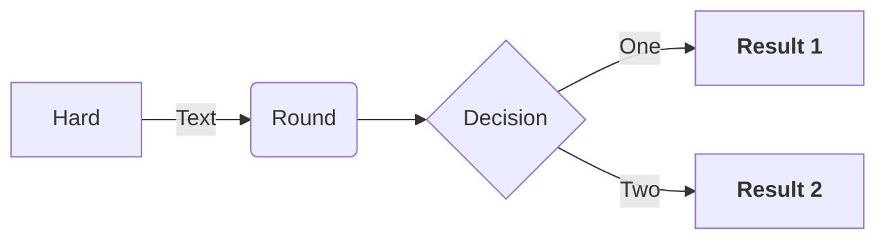
```mermaid
flowchart LR
  A[Hard] -->|Text| B(Round)
  B --> C{Decision}
  C -->|One| D["`**Result 1**`"]
  C -->|Two| E["`**Result 2**`"]
```

```
flowchart TD
  A[Hard] -->|Text| B(Round)
  B --> C{Decision}
  C -->|One| D["`**Result 1**`"]
  C -->|Two| E["`**Result 2**`"]
```

> Source: [https://mermaid.js.org/syntax/flowchart.html](https://mermaid.js.org/syntax/flowchart.html)

## Swimlane Diagram

```mermaid
swimlane-beta LR
  subgraph Customer
    request[Request service]
    receive[Receive update]
  end

  subgraph Support
    triage[Triage request]
    answer[Send answer]
  end

  subgraph Engineering
    investigate[Investigate issue]
    fix[Prepare fix]
  end

  request --> triage
  triage -->|Known issue| answer
  triage -->|Needs code change| investigate
  investigate --> fix --> answer
  answer --> receive
```

```
swimlane-beta LR
  subgraph Customer
    request[Request service]
    receive[Receive update]
  end

  subgraph Support
    triage[Triage request]
    answer[Send answer]
  end

  subgraph Engineering
    investigate[Investigate issue]
    fix[Prepare fix]
  end

  request --> triage
  triage -->|Known issue| answer
  triage -->|Needs code change| investigate
  investigate --> fix --> answer
  answer --> receive
```

> Source: [https://mermaid.js.org/syntax/swimlanes.html](https://mermaid.js.org/syntax/swimlanes.html)

## Sequence Diagram

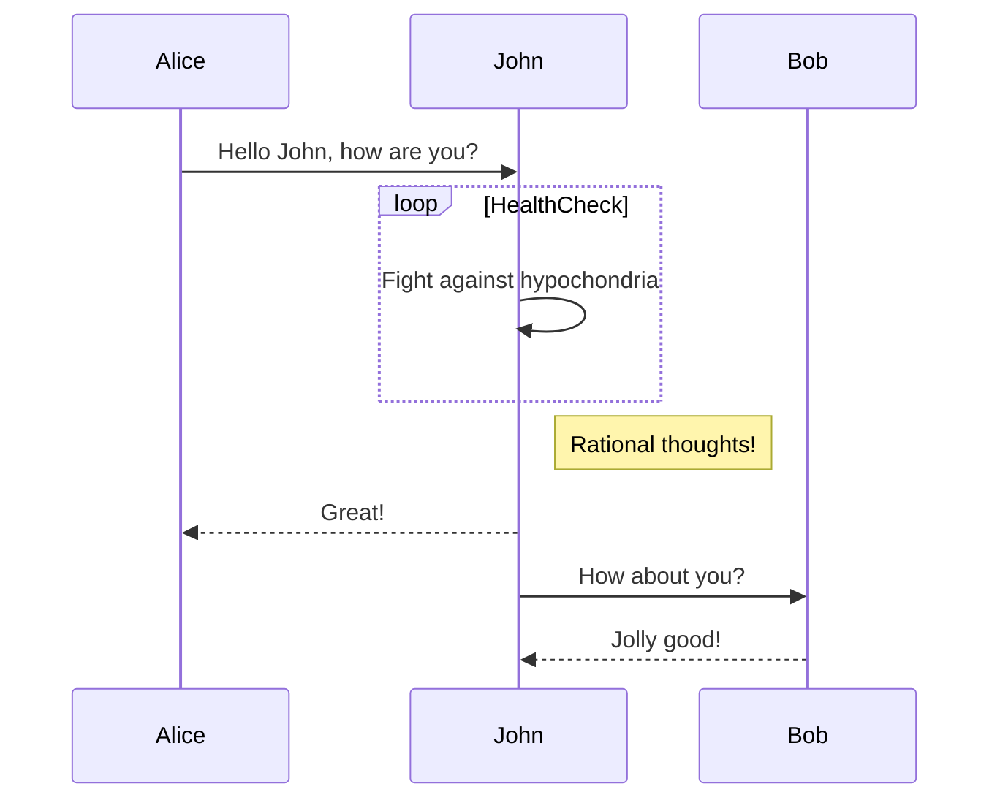
```mermaid
sequenceDiagram
  Alice->>John: Hello John, how are you?
  loop HealthCheck
    John->>John: Fight against hypochondria
  end
  Note right of John: Rational thoughts!
  John-->>Alice: Great!
  John->>Bob: How about you?
  Bob-->>John: Jolly good!
```

```
sequenceDiagram
  Alice->>John: Hello John, how are you?
  loop HealthCheck
    John->>John: Fight against hypochondria
  end
  Note right of John: Rational thoughts!
  John-->>Alice: Great!
  John->>Bob: How about you?
  Bob-->>John: Jolly good!
```

> Source: [https://mermaid.js.org/syntax/sequenceDiagram.html](https://mermaid.js.org/syntax/sequenceDiagram.html)

## Class Diagram

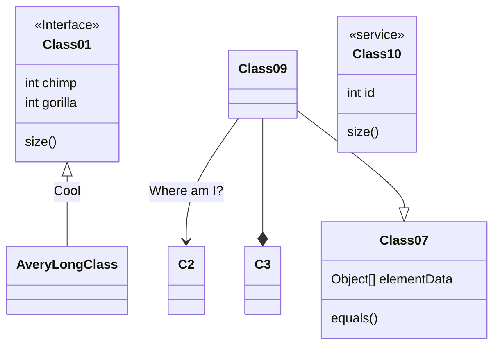
```mermaid
classDiagram
  Class01 <|-- AveryLongClass : Cool
  <<Interface>> Class01
  Class09 --> C2 : Where am I?
  Class09 --* C3
  Class09 --|> Class07
  Class07 : equals()
  Class07 : Object[] elementData
  Class01 : size()
  Class01 : int chimp
  Class01 : int gorilla
  class Class10 {
    <<service>>
    int id
    size()
  }
```

```
classDiagram
  Class01 <|-- AveryLongClass : Cool
  <<Interface>> Class01
  Class09 --> C2 : Where am I?
  Class09 --* C3
  Class09 --|> Class07
  Class07 : equals()
  Class07 : Object[] elementData
  Class01 : size()
  Class01 : int chimp
  Class01 : int gorilla
  class Class10 {
    <<service>>
    int id
    size()
  }
```

> Source: [https://mermaid.js.org/syntax/classDiagram.html](https://mermaid.js.org/syntax/classDiagram.html)

## State Diagram

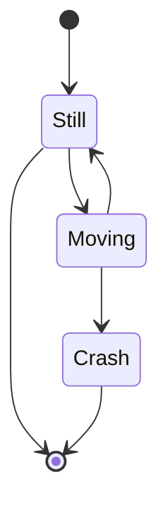
```mermaid
stateDiagram-v2
  [*]     --> Still
  Still   --> [*]
  Still   --> Moving
  Moving  --> Still
  Moving  --> Crash
  Crash   --> [*]
```

```
stateDiagram-v2
  [*]     --> Still
  Still   --> [*]
  Still   --> Moving
  Moving  --> Still
  Moving  --> Crash
  Crash   --> [*]
```

> Source: [https://mermaid.js.org/syntax/stateDiagram.html](https://mermaid.js.org/syntax/stateDiagram.html)


## Entity Relationship Diagram

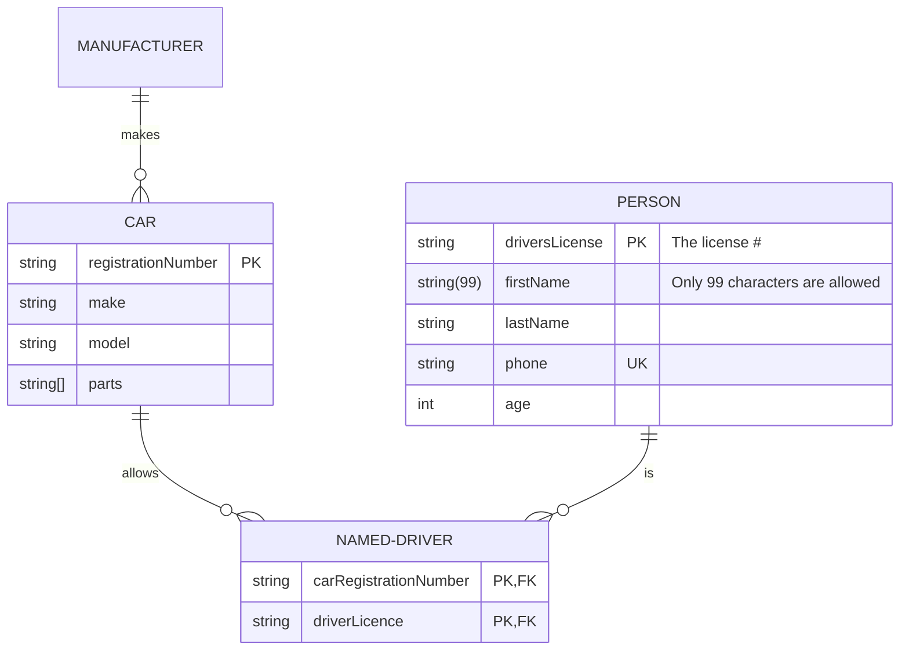
```mermaid
erDiagram
  CAR ||--o{ NAMED-DRIVER : allows
  CAR {
    string registrationNumber PK
    string make
    string model
    string[] parts
  }
  PERSON ||--o{ NAMED-DRIVER : is
  PERSON {
    string driversLicense PK "The license #"
    string(99) firstName "Only 99 characters are allowed"
    string lastName
    string phone UK
    int age
  }
  NAMED-DRIVER {
    string carRegistrationNumber PK, FK
    string driverLicence PK, FK
  }
  MANUFACTURER only one to zero or more CAR : makes
```

```
erDiagram
  CAR ||--o{ NAMED-DRIVER : allows
  CAR {
    string registrationNumber PK
    string make
    string model
    string[] parts
  }
  PERSON ||--o{ NAMED-DRIVER : is
  PERSON {
    string driversLicense PK "The license #"
    string(99) firstName "Only 99 characters are allowed"
    string lastName
    string phone UK
    int age
  }
  NAMED-DRIVER {
    string carRegistrationNumber PK, FK
    string driverLicence PK, FK
  }
  "**MANUFACTURER**" only one to zero or more CAR : makes
```

>Source: [https://mermaid.js.org/syntax/entityRelationshipDiagram.html](https://mermaid.js.org/syntax/entityRelationshipDiagram.html)

## User Journey Diagram

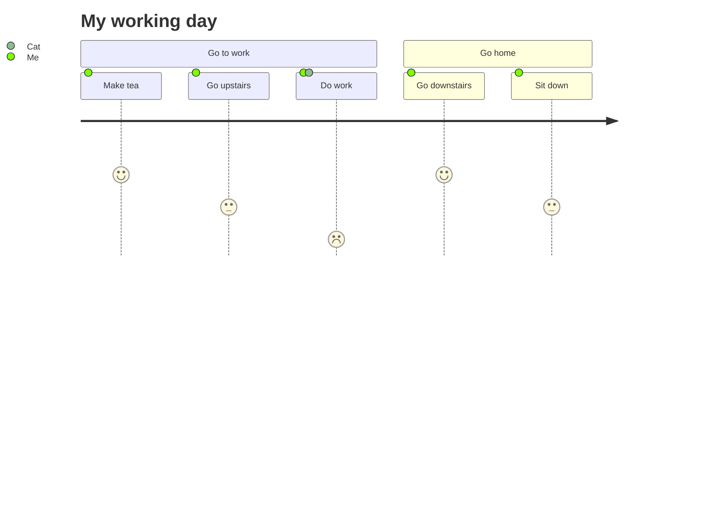
```mermaid
journey
  title My working day
  section Go to work
    Make tea      : 5: Me
    Go upstairs   : 3: Me
    Do work       : 1: Me, Cat
  section Go home
    Go downstairs : 5: Me
    Sit down      : 3: Me
```

```
journey
  title My working day
  section Go to work
    Make tea      : 5: Me
    Go upstairs   : 3: Me
    Do work       : 1: Me, Cat
  section Go home
    Go downstairs : 5: Me
    Sit down      : 3: Me
```

> Source: [https://mermaid.js.org/syntax/userJourney.html](https://mermaid.js.org/syntax/userJourney.html)

## Gantt Chart

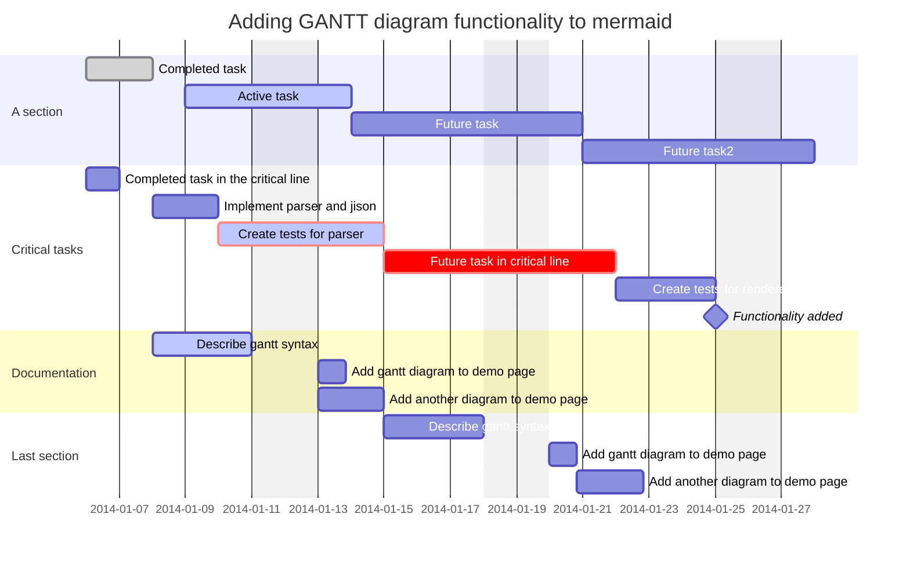
```mermaid
gantt
  dateFormat  YYYY-MM-DD
  title       Adding GANTT diagram functionality to mermaid
  excludes    weekends
  %% (`excludes` accepts specific dates in YYYY-MM-DD format, days of the week ("sunday") or "weekends", but not the word "weekdays".)

  section A section
  Completed task            :done,    des1, 2014-01-06,2014-01-08
  Active task               :active,  des2, 2014-01-09, 3d
  Future task               :         des3, after des2, 5d
  Future task2              :         des4, after des3, 5d

  section Critical tasks
  Completed task in the critical line :2014-01-06,24h
  Implement parser and jison          :after des1, 2d
  Create tests for parser             :crit, active, 3d
  Future task in critical line        :crit, 5d
  Create tests for renderer           :3d
  Functionality added                 :milestone, isadded, 2014-01-25, 0d

  section Documentation
  Describe gantt syntax               :active, a1, after des1, 3d
  Add gantt diagram to demo page      :after a1  , 20h
  Add another diagram to demo page    :doc1, after a1  , 48h

  section Last section
  Describe gantt syntax               :after doc1, 3d
  Add gantt diagram to demo page      :20h
  Add another diagram to demo page    :48h
```

```
gantt
  dateFormat  YYYY-MM-DD
  title       Adding GANTT diagram functionality to mermaid
  excludes    weekends
  %% (`excludes` accepts specific dates in YYYY-MM-DD format, days of the week ("sunday") or "weekends", but not the word "weekdays".)

  section A section
  Completed task            :done,    des1, 2014-01-06,2014-01-08
  Active task               :active,  des2, 2014-01-09, 3d
  Future task               :         des3, after des2, 5d
  Future task2              :         des4, after des3, 5d

  section Critical tasks
  Completed task in the critical line :2014-01-06,24h
  Implement parser and jison          :after des1, 2d
  Create tests for parser             :crit, active, 3d
  Future task in critical line        :crit, 5d
  Create tests for renderer           :3d
  Functionality added                 :milestone, isadded, 2014-01-25, 0d

  section Documentation
  Describe gantt syntax               :active, a1, after des1, 3d
  Add gantt diagram to demo page      :after a1  , 20h
  Add another diagram to demo page    :doc1, after a1  , 48h

  section Last section
  Describe gantt syntax               :after doc1, 3d
  Add gantt diagram to demo page      :20h
  Add another diagram to demo page    :48h
```

> Source: [https://mermaid.js.org/syntax/gantt.html](https://mermaid.js.org/syntax/gantt.html)

### Bar chart

:::note
Bar chart using **Gantt Chart** documentation
:::


```mermaid
gantt
  title Git Issues - days since last update
  dateFormat  X
  axisFormat %s

  section Issue19062
  71   : 0, 71
  section Issue19401
  36   : 0, 36
  section Issue193
  34   : 0, 34
  section Issue7441
  9    : 0, 9
  section Issue1300
  5    : 0, 5
```

```
gantt
  title Git Issues - days since last update
  dateFormat  X
  axisFormat %s

  section Issue19062
  71   : 0, 71
  section Issue19401
  36   : 0, 36
  section Issue193
  34   : 0, 34
  section Issue7441
  9    : 0, 9
  section Issue1300
  5    : 0, 5
```

## Pie Chart

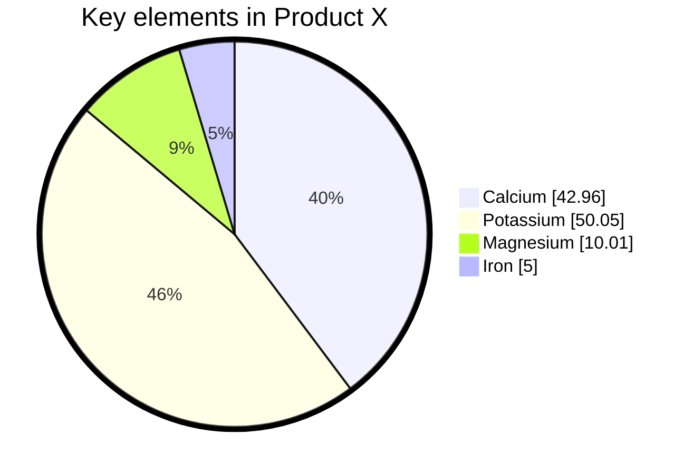
```mermaid
---
config:
  pie:
    textPosition: 0.5
    donutHole: 0.2
    highlightSlice: Potassium
  themeVariables:
    pieOuterStrokeWidth: "5px"
---
pie showData
  title Key elements in Product X
  "Calcium" : 42.96
  "Potassium" : 50.05
  "Magnesium" : 10.01
  "Iron" :  5
```

```
---
config:
  pie:
    textPosition: 0.5
    donutHole: 0.2
    highlightSlice: Potassium
  themeVariables:
    pieOuterStrokeWidth: "5px"
---
pie showData
  title Key elements in Product X
  "Calcium" : 42.96
  "Potassium" : 50.05
  "Magnesium" : 10.01
  "Iron" :  5
```

> Source: [https://mermaid.js.org/syntax/pie.html](https://mermaid.js.org/syntax/pie.html)

## Quadrant Chart

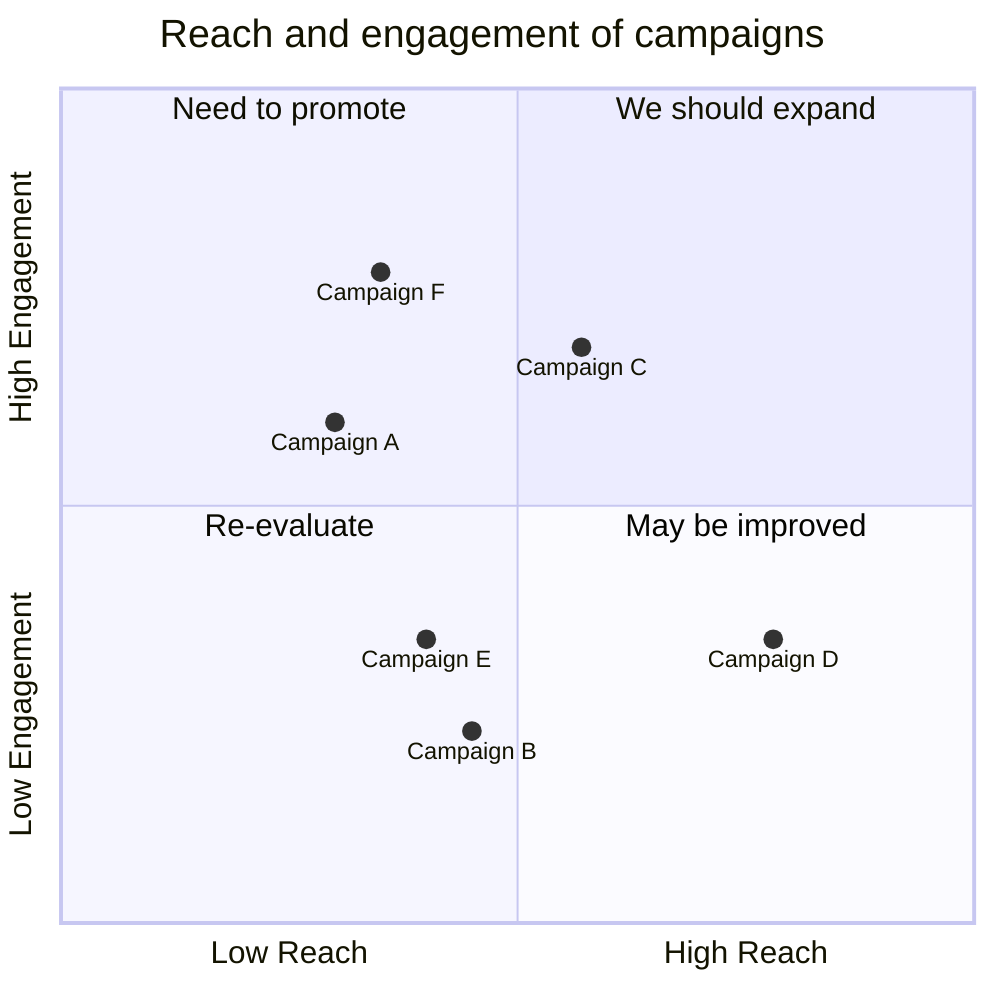
```mermaid
quadrantChart
  title Reach and engagement of campaigns
  x-axis Low Reach --> High Reach
  y-axis Low Engagement --> High Engagement
  quadrant-1 We should expand
  quadrant-2 Need to promote
  quadrant-3 Re-evaluate
  quadrant-4 May be improved
  Campaign A: [0.3, 0.6]
  Campaign B: [0.45, 0.23]
  Campaign C: [0.57, 0.69]
  Campaign D: [0.78, 0.34]
  Campaign E: [0.40, 0.34]
  Campaign F: [0.35, 0.78]
```

```
quadrantChart
  title Reach and engagement of campaigns
  x-axis Low Reach --> High Reach
  y-axis Low Engagement --> High Engagement
  quadrant-1 We should expand
  quadrant-2 Need to promote
  quadrant-3 Re-evaluate
  quadrant-4 May be improved
  Campaign A: [0.3, 0.6]
  Campaign B: [0.45, 0.23]
  Campaign C: [0.57, 0.69]
  Campaign D: [0.78, 0.34]
  Campaign E: [0.40, 0.34]
  Campaign F: [0.35, 0.78]
```

> Source: [https://mermaid.js.org/syntax/quadrantChart.html](https://mermaid.js.org/syntax/quadrantChart.html)

## Requirement Diagram

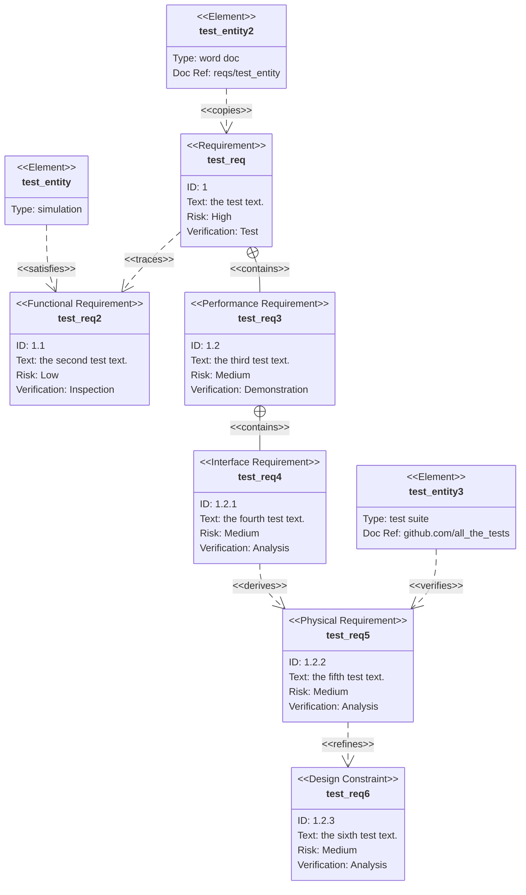
```mermaid
requirementDiagram

  requirement test_req {
    id: 1
    text: the test text.
    risk: high
    verifymethod: test
  }

  functionalRequirement test_req2 {
    id: 1.1
    text: the second test text.
    risk: low
    verifymethod: inspection
  }

  performanceRequirement test_req3 {
    id: 1.2
    text: the third test text.
    risk: medium
    verifymethod: demonstration
  }

  interfaceRequirement test_req4 {
    id: 1.2.1
    text: the fourth test text.
    risk: medium
    verifymethod: analysis
  }

  physicalRequirement test_req5 {
    id: 1.2.2
    text: the fifth test text.
    risk: medium
    verifymethod: analysis
  }

  designConstraint test_req6 {
    id: 1.2.3
    text: the sixth test text.
    risk: medium
    verifymethod: analysis
  }

  element test_entity {
    type: simulation
  }

  element test_entity2 {
    type: word doc
    docRef: reqs/test_entity
  }

  element test_entity3 {
    type: "test suite"
    docRef: github.com/all_the_tests
  }

  test_entity - satisfies -> test_req2
  test_req - traces -> test_req2
  test_req - contains -> test_req3
  test_req3 - contains -> test_req4
  test_req4 - derives -> test_req5
  test_req5 - refines -> test_req6
  test_entity3 - verifies -> test_req5
  test_req <- copies - test_entity2
```

```
requirementDiagram

  requirement test_req {
    id: 1
    text: the test text.
    risk: high
    verifymethod: test
  }

  functionalRequirement test_req2 {
    id: 1.1
    text: the second test text.
    risk: low
    verifymethod: inspection
  }

  performanceRequirement test_req3 {
    id: 1.2
    text: the third test text.
    risk: medium
    verifymethod: demonstration
  }

  interfaceRequirement test_req4 {
    id: 1.2.1
    text: the fourth test text.
    risk: medium
    verifymethod: analysis
  }

  physicalRequirement test_req5 {
    id: 1.2.2
    text: the fifth test text.
    risk: medium
    verifymethod: analysis
  }

  designConstraint test_req6 {
    id: 1.2.3
    text: the sixth test text.
    risk: medium
    verifymethod: analysis
  }

  element test_entity {
    type: simulation
  }

  element test_entity2 {
    type: word doc
    docRef: reqs/test_entity
  }

  element test_entity3 {
    type: "test suite"
    docRef: github.com/all_the_tests
  }

  test_entity - satisfies -> test_req2
  test_req - traces -> test_req2
  test_req - contains -> test_req3
  test_req3 - contains -> test_req4
  test_req4 - derives -> test_req5
  test_req5 - refines -> test_req6
  test_entity3 - verifies -> test_req5
  test_req <- copies - test_entity2
```

> Source: [https://mermaid.js.org/syntax/requirementDiagram.html](https://mermaid.js.org/syntax/requirementDiagram.html)

## Git Graph

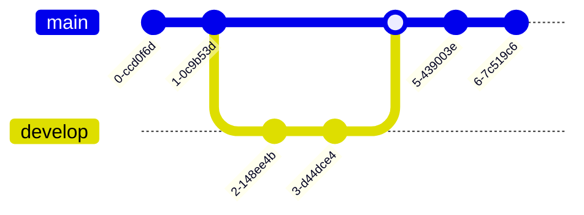
```mermaid
gitGraph
  commit
  commit
  branch develop
  checkout develop
  commit
  commit
  checkout main
  merge develop
  commit
  commit
```

```
gitGraph
  commit
  commit
  branch develop
  checkout develop
  commit
  commit
  checkout main
  merge develop
  commit
  commit
```

> Source: [https://mermaid.js.org/syntax/gitgraph.html](https://mermaid.js.org/syntax/gitgraph.html)

## C4 Diagram

:::warning
*C4 is on experimental*
:::

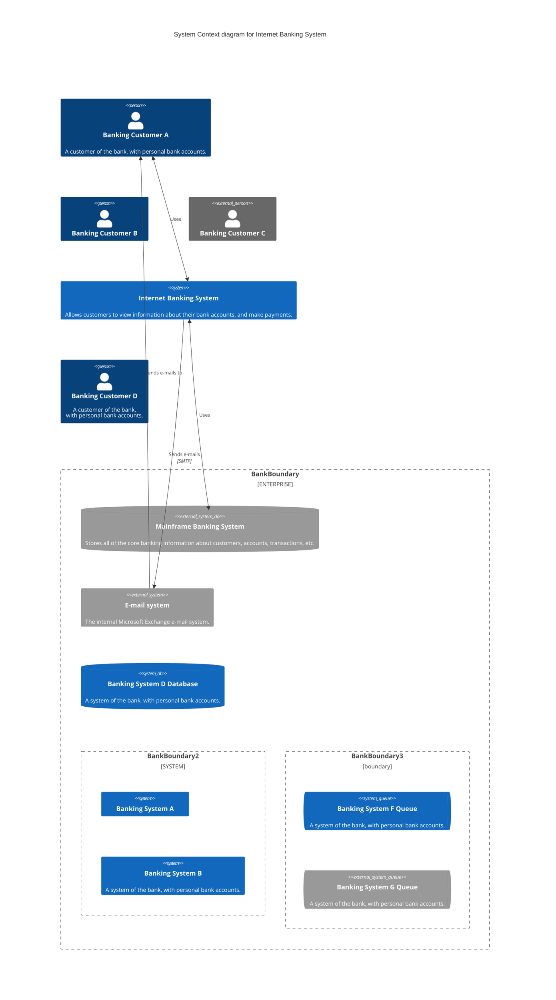
```mermaid
C4Context
  title System Context diagram for Internet Banking System

  Person(customerA, "Banking Customer A", "A customer of the bank, with personal bank accounts.")
  Person(customerB, "Banking Customer B")
  Person_Ext(customerC, "Banking Customer C")
  System(SystemAA, "Internet Banking System", "Allows customers to view information about their bank accounts, and make payments.")

  Person(customerD, "Banking Customer D", "A customer of the bank, <br/> with personal bank accounts.")

  Enterprise_Boundary(b1, "BankBoundary") {

    SystemDb_Ext(SystemE, "Mainframe Banking System", "Stores all of the core banking information about customers, accounts, transactions, etc.")

    System_Boundary(b2, "BankBoundary2") {
      System(SystemA, "Banking System A")
      System(SystemB, "Banking System B", "A system of the bank, with personal bank accounts.")
    }

    System_Ext(SystemC, "E-mail system", "The internal Microsoft Exchange e-mail system.")
    SystemDb(SystemD, "Banking System D Database", "A system of the bank, with personal bank accounts.")

    Boundary(b3, "BankBoundary3", "boundary") {
      SystemQueue(SystemF, "Banking System F Queue", "A system of the bank, with personal bank accounts.")
      SystemQueue_Ext(SystemG, "Banking System G Queue", "A system of the bank, with personal bank accounts.")
    }
  }

  BiRel(customerA, SystemAA, "Uses")
  BiRel(SystemAA, SystemE, "Uses")
  Rel(SystemAA, SystemC, "Sends e-mails", "SMTP")
  Rel(SystemC, customerA, "Sends e-mails to")
```

```
C4Context
  title System Context diagram for Internet Banking System

  Person(customerA, "Banking Customer A", "A customer of the bank, with personal bank accounts.")
  Person(customerB, "Banking Customer B")
  Person_Ext(customerC, "Banking Customer C")
  System(SystemAA, "Internet Banking System", "Allows customers to view information about their bank accounts, and make payments.")

  Person(customerD, "Banking Customer D", "A customer of the bank, <br/> with personal bank accounts.")

  Enterprise_Boundary(b1, "BankBoundary") {

    SystemDb_Ext(SystemE, "Mainframe Banking System", "Stores all of the core banking information about customers, accounts, transactions, etc.")

    System_Boundary(b2, "BankBoundary2") {
      System(SystemA, "Banking System A")
      System(SystemB, "Banking System B", "A system of the bank, with personal bank accounts.")
    }

    System_Ext(SystemC, "E-mail system", "The internal Microsoft Exchange e-mail system.")
    SystemDb(SystemD, "Banking System D Database", "A system of the bank, with personal bank accounts.")

    Boundary(b3, "BankBoundary3", "boundary") {
      SystemQueue(SystemF, "Banking System F Queue", "A system of the bank, with personal bank accounts.")
      SystemQueue_Ext(SystemG, "Banking System G Queue", "A system of the bank, with personal bank accounts.")
    }
  }

  BiRel(customerA, SystemAA, "Uses")
  BiRel(SystemAA, SystemE, "Uses")
  Rel(SystemAA, SystemC, "Sends e-mails", "SMTP")
  Rel(SystemC, customerA, "Sends e-mails to")
```

> Source: [https://mermaid.js.org/syntax/c4.html](https://mermaid.js.org/syntax/c4.html)

## Mindmap

:::warning
*Mindmap is on experimental*
:::

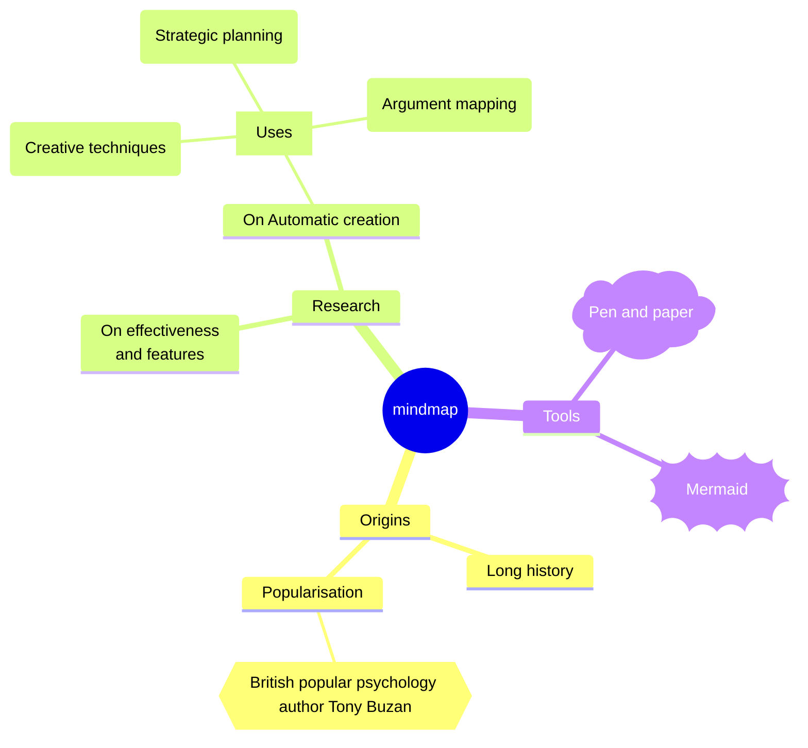
```mermaid
mindmap
  root((mindmap))
    Origins
      Long history
      ::icon(fa fa-book)
      Popularisation
        {{British popular psychology author Tony Buzan}}
    Research
      On effectiveness<br/>and features
      On Automatic creation
        [Uses]
          (Creative techniques)
          (Strategic planning)
          (Argument mapping)
    Tools
      )Pen and paper(
      ))Mermaid((
```

```
mindmap
  root((mindmap))
    Origins
      Long history
      ::icon(fa fa-book)
      Popularisation
        {{British popular psychology author Tony Buzan}}
    Research
      On effectiveness<br/>and features
      On Automatic creation
        [Uses]
          (Creative techniques)
          (Strategic planning)
          (Argument mapping)
    Tools
      )Pen and paper(
      ))Mermaid((
```

> Source: [https://mermaid.js.org/syntax/mindmap.html](https://mermaid.js.org/syntax/mindmap.html)

## Timeline Diagram

:::warning
*Timeline Diagram is on experimental*
:::

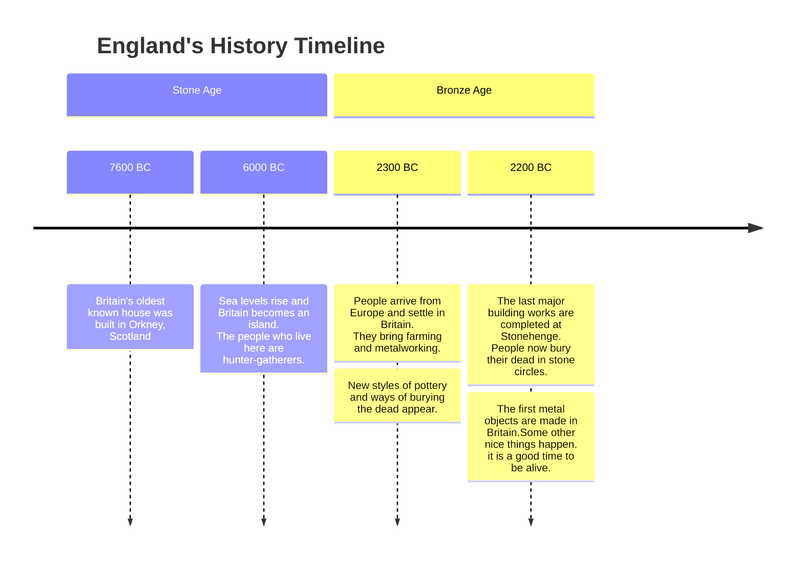
```mermaid
timeline
  title England's History Timeline
  section Stone Age
    7600 BC : Britain's oldest known house was built in Orkney, Scotland
    6000 BC : Sea levels rise and Britain becomes an island.<br> The people who live here are hunter-gatherers.
  section Bronze Age
    2300 BC : People arrive from Europe and settle in Britain. <br>They bring farming and metalworking.
            : New styles of pottery and ways of burying the dead appear.
    2200 BC : The last major building works are completed at Stonehenge.<br> People now bury their dead in stone circles.
            : The first metal objects are made in Britain.Some other nice things happen. it is a good time to be alive.
```

```
timeline
  title England's History Timeline
  section Stone Age
    7600 BC : Britain's oldest known house was built in Orkney, Scotland
    6000 BC : Sea levels rise and Britain becomes an island.<br> The people who live here are hunter-gatherers.
  section Bronze Age
    2300 BC : People arrive from Europe and settle in Britain. <br>They bring farming and metalworking.
            : New styles of pottery and ways of burying the dead appear.
    2200 BC : The last major building works are completed at Stonehenge.<br> People now bury their dead in stone circles.
            : The first metal objects are made in Britain.Some other nice things happen. it is a good time to be alive.
```

> Source: [https://mermaid.js.org/syntax/mindmap.html](https://mermaid.js.org/syntax/mindmap.html)

## ZenUML

:::caution
**ZenUML** is **not supported** by [rehype-mermaid](https://github.com/remcohaszing/rehype-mermaid). Use [**Sequnce Diagram**](#sequence-diagram) istead.
:::

> Source: [https://mermaid.js.org/syntax/zenuml.html](https://mermaid.js.org/syntax/zenuml.html)

## Sankey Diagram

:::warning
*Sankey Diagram is on experimental*
:::

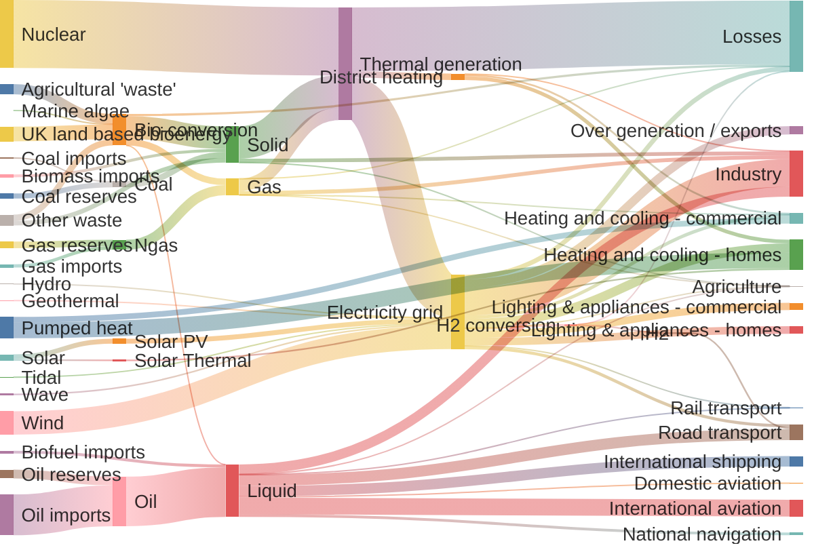
```mermaid
---
config:
  sankey:
    showValues: false
---
sankey
  Agricultural 'waste',Bio-conversion,124.729
  Bio-conversion,Liquid,0.597
  Bio-conversion,Losses,26.862
  Bio-conversion,Solid,280.322
  Bio-conversion,Gas,81.144
  Biofuel imports,Liquid,35
  Biomass imports,Solid,35
  Coal imports,Coal,11.606
  Coal reserves,Coal,63.965
  Coal,Solid,75.571
  District heating,Industry,10.639
  District heating,Heating and cooling - commercial,22.505
  District heating,Heating and cooling - homes,46.184
  Electricity grid,Over generation / exports,104.453
  Electricity grid,Heating and cooling - homes,113.726
  Electricity grid,H2 conversion,27.14
  Electricity grid,Industry,342.165
  Electricity grid,Road transport,37.797
  Electricity grid,Agriculture,4.412
  Electricity grid,Heating and cooling - commercial,40.858
  Electricity grid,Losses,56.691
  Electricity grid,Rail transport,7.863
  Electricity grid,Lighting & appliances - commercial,90.008
  Electricity grid,Lighting & appliances - homes,93.494
  Gas imports,Ngas,40.719
  Gas reserves,Ngas,82.233
  Gas,Heating and cooling - commercial,0.129
  Gas,Losses,1.401
  Gas,Thermal generation,151.891
  Gas,Agriculture,2.096
  Gas,Industry,48.58
  Geothermal,Electricity grid,7.013
  H2 conversion,H2,20.897
  H2 conversion,Losses,6.242
  H2,Road transport,20.897
  Hydro,Electricity grid,6.995
  Liquid,Industry,121.066
  Liquid,International shipping,128.69
  Liquid,Road transport,135.835
  Liquid,Domestic aviation,14.458
  Liquid,International aviation,206.267
  Liquid,Agriculture,3.64
  Liquid,National navigation,33.218
  Liquid,Rail transport,4.413
  Marine algae,Bio-conversion,4.375
  Ngas,Gas,122.952
  Nuclear,Thermal generation,839.978
  Oil imports,Oil,504.287
  Oil reserves,Oil,107.703
  Oil,Liquid,611.99
  Other waste,Solid,56.587
  Other waste,Bio-conversion,77.81
  Pumped heat,Heating and cooling - homes,193.026
  Pumped heat,Heating and cooling - commercial,70.672
  Solar PV,Electricity grid,59.901
  Solar Thermal,Heating and cooling - homes,19.263
  Solar,Solar Thermal,19.263
  Solar,Solar PV,59.901
  Solid,Agriculture,0.882
  Solid,Thermal generation,400.12
  Solid,Industry,46.477
  Thermal generation,Electricity grid,525.531
  Thermal generation,Losses,787.129
  Thermal generation,District heating,79.329
  Tidal,Electricity grid,9.452
  UK land based bioenergy,Bio-conversion,182.01
  Wave,Electricity grid,19.013
  Wind,Electricity grid,289.366
```

```
---
config:
  sankey:
    showValues: false
---
sankey
  Agricultural 'waste',Bio-conversion,124.729
  Bio-conversion,Liquid,0.597
  Bio-conversion,Losses,26.862
  Bio-conversion,Solid,280.322
  Bio-conversion,Gas,81.144
  Biofuel imports,Liquid,35
  Biomass imports,Solid,35
  Coal imports,Coal,11.606
  Coal reserves,Coal,63.965
  Coal,Solid,75.571
  District heating,Industry,10.639
  District heating,Heating and cooling - commercial,22.505
  District heating,Heating and cooling - homes,46.184
  Electricity grid,Over generation / exports,104.453
  Electricity grid,Heating and cooling - homes,113.726
  Electricity grid,H2 conversion,27.14
  Electricity grid,Industry,342.165
  Electricity grid,Road transport,37.797
  Electricity grid,Agriculture,4.412
  Electricity grid,Heating and cooling - commercial,40.858
  Electricity grid,Losses,56.691
  Electricity grid,Rail transport,7.863
  Electricity grid,Lighting & appliances - commercial,90.008
  Electricity grid,Lighting & appliances - homes,93.494
  Gas imports,Ngas,40.719
  Gas reserves,Ngas,82.233
  Gas,Heating and cooling - commercial,0.129
  Gas,Losses,1.401
  Gas,Thermal generation,151.891
  Gas,Agriculture,2.096
  Gas,Industry,48.58
  Geothermal,Electricity grid,7.013
  H2 conversion,H2,20.897
  H2 conversion,Losses,6.242
  H2,Road transport,20.897
  Hydro,Electricity grid,6.995
  Liquid,Industry,121.066
  Liquid,International shipping,128.69
  Liquid,Road transport,135.835
  Liquid,Domestic aviation,14.458
  Liquid,International aviation,206.267
  Liquid,Agriculture,3.64
  Liquid,National navigation,33.218
  Liquid,Rail transport,4.413
  Marine algae,Bio-conversion,4.375
  Ngas,Gas,122.952
  Nuclear,Thermal generation,839.978
  Oil imports,Oil,504.287
  Oil reserves,Oil,107.703
  Oil,Liquid,611.99
  Other waste,Solid,56.587
  Other waste,Bio-conversion,77.81
  Pumped heat,Heating and cooling - homes,193.026
  Pumped heat,Heating and cooling - commercial,70.672
  Solar PV,Electricity grid,59.901
  Solar Thermal,Heating and cooling - homes,19.263
  Solar,Solar Thermal,19.263
  Solar,Solar PV,59.901
  Solid,Agriculture,0.882
  Solid,Thermal generation,400.12
  Solid,Industry,46.477
  Thermal generation,Electricity grid,525.531
  Thermal generation,Losses,787.129
  Thermal generation,District heating,79.329
  Tidal,Electricity grid,9.452
  UK land based bioenergy,Bio-conversion,182.01
  Wave,Electricity grid,19.013
  Wind,Electricity grid,289.366
```

> Source: [https://mermaid.js.org/syntax/sankey.html](https://mermaid.js.org/syntax/sankey.html)

## XY Chart

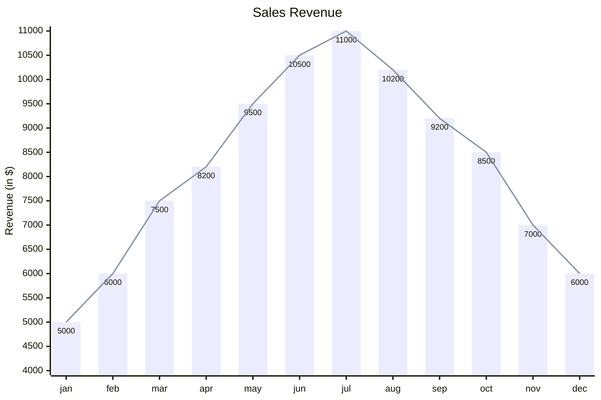
```mermaid
---
config:
  xyChart:
    width: 900
    height: 600
    showDataLabel: true
---
xychart
  title "Sales Revenue"
  x-axis [jan, feb, mar, apr, may, jun, jul, aug, sep, oct, nov, dec]
  y-axis "Revenue (in $)" 4000 --> 11000
  bar [5000, 6000, 7500, 8200, 9500, 10500, 11000, 10200, 9200, 8500, 7000, 6000]
  line [5000, 6000, 7500, 8200, 9500, 10500, 11000, 10200, 9200, 8500, 7000, 6000]
```

```
---
config:
  xyChart:
    width: 900
    height: 600
    showDataLabel: true
---
xychart
  title "Sales Revenue"
  x-axis [jan, feb, mar, apr, may, jun, jul, aug, sep, oct, nov, dec]
  y-axis "Revenue (in $)" 4000 --> 11000
  bar [5000, 6000, 7500, 8200, 9500, 10500, 11000, 10200, 9200, 8500, 7000, 6000]
  line [5000, 6000, 7500, 8200, 9500, 10500, 11000, 10200, 9200, 8500, 7000, 6000]
```

### Line Chart

```mermaid
---
config:
  themeVariables:
    xyChart:
      plotColorPalette: '#00FF00'
---
xychart
  title "Smallest AI models scoring above 60% on MMLU"
  x-axis "Date" ["Apr 2022", "Feb 2023", "Jul 2023", "Sep 2023", "Apr 2024"]
  y-axis "Parameters (B)" 0 --> 600
  line [540 "PaLM", 65 "LLaMA-65B", 34 "Llama 2 34B", 7 "Mistral 7B", 3.8 "Phi-3-mini"]
```

```
xychart
  title "Smallest AI models scoring above 60% on MMLU"
  x-axis "Date" ["Apr 2022", "Feb 2023", "Jul 2023", "Sep 2023", "Apr 2024"]
  y-axis "Parameters (B)" 0 --> 600
  line [540 "PaLM", 65 "LLaMA-65B", 34 "Llama 2 34B", 7 "Mistral 7B", 3.8 "Phi-3-mini"]
```

> Source: [https://mermaid.js.org/syntax/xyChart.html](https://mermaid.js.org/syntax/xyChart.html)

## Block Diagram

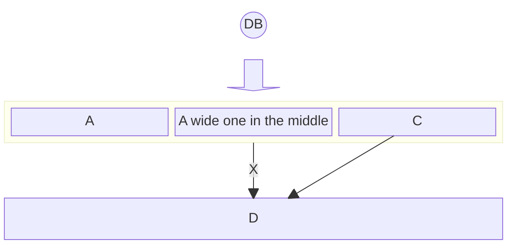
```mermaid
block
  columns 1
    db(("DB"))
    blockArrowId6<["&nbsp;&nbsp;&nbsp;"]>(down)
    block:ID
      A
      B["A wide one in the middle"]
      C
    end
    space
    D
    ID-- "X" -->D
    C --> D
```

```
block
  columns 1
    db(("DB"))
    blockArrowId6<["&nbsp;&nbsp;&nbsp;"]>(down)
    block:ID
      A
      B["A wide one in the middle"]
      C
    end
    space
    D
    ID-- "X" -->D
    C --> D
```

> Source: [https://mermaid.js.org/syntax/block.html](https://mermaid.js.org/syntax/block.html)

## Packet Diagram

```mermaid
---
title: "TCP Packet"
---
packet
  0-15: "Source Port"
  16-31: "Destination Port"
  32-63: "Sequence Number"
  64-95: "Acknowledgment Number"
  96-99: "Data Offset"
  100-105: "Reserved"
  106: "URG"
  107: "ACK"
  108: "PSH"
  109: "RST"
  110: "SYN"
  111: "FIN"
  112-127: "Window"
  128-143: "Checksum"
  144-159: "Urgent Pointer"
  160-191: "(Options and Padding)"
  192-255: "Data (variable length)"
```

```
---
title: "TCP Packet"
---
packet
  0-15: "Source Port"
  16-31: "Destination Port"
  32-63: "Sequence Number"
  64-95: "Acknowledgment Number"
  96-99: "Data Offset"
  100-105: "Reserved"
  106: "URG"
  107: "ACK"
  108: "PSH"
  109: "RST"
  110: "SYN"
  111: "FIN"
  112-127: "Window"
  128-143: "Checksum"
  144-159: "Urgent Pointer"
  160-191: "(Options and Padding)"
  192-255: "Data (variable length)"
```

> Source: [https://mermaid.js.org/syntax/packet.html](https://mermaid.js.org/syntax/packet.html)

## Kanban Diagram

```mermaid
---
config:
  kanban:
    ticketBaseUrl: 'https://mermaidchart.atlassian.net/browse/#TICKET#'
---
kanban
  Todo
    [Create Documentation]
    docs[Create Blog about the new diagram]
  [In progress]
    id6[Create renderer so that it works in all cases. We also add some extra text here for testing purposes. And some more just for the extra flare.]
  id9[Ready for deploy]
    id8[Design grammar]@{ assigned: 'knsv' }
  id10[Ready for test]
    id4[Create parsing tests]@{ ticket: MC-2038, assigned: 'K.Sveidqvist', priority: 'High' }
    id66[last item]@{ priority: 'Very Low', assigned: 'knsv' }
  id11[Done]
    id5[define getData]
    id2[Title of diagram is more than 100 chars when user duplicates diagram with 100 char]@{ ticket: MC-2036, priority: 'Very High'}
    id3[Update DB function]@{ ticket: MC-2037, assigned: knsv, priority: 'High' }

  id12[Can't reproduce]
    id3[Weird flickering in Firefox]
```

```
---
config:
  kanban:
    ticketBaseUrl: 'https://mermaidchart.atlassian.net/browse/#TICKET#'
---
kanban
  Todo
    [Create Documentation]
    docs[Create Blog about the new diagram]
  [In progress]
    id6[Create renderer so that it works in all cases. We also add some extra text here for testing purposes. And some more just for the extra flare.]
  id9[Ready for deploy]
    id8[Design grammar]@{ assigned: 'knsv' }
  id10[Ready for test]
    id4[Create parsing tests]@{ ticket: MC-2038, assigned: 'K.Sveidqvist', priority: 'High' }
    id66[last item]@{ priority: 'Very Low', assigned: 'knsv' }
  id11[Done]
    id5[define getData]
    id2[Title of diagram is more than 100 chars when user duplicates diagram with 100 char]@{ ticket: MC-2036, priority: 'Very High'}
    id3[Update DB function]@{ ticket: MC-2037, assigned: knsv, priority: 'High' }

  id12[Can't reproduce]
    id3[Weird flickering in Firefox]
```

> Source: [https://mermaid.js.org/syntax/kanban.html](https://mermaid.js.org/syntax/kanban.html)

## Architecture Diagram

```mermaid
architecture-beta
  group api(cloud)[API]

  service db(database)[Database] in api
  service disk1(disk)[Storage] in api
  service disk2(disk)[Storage] in api
  service server(server)[Server] in api

  db:L -- R:server
  disk1:T -- B:server
  disk2:T -- B:db
```

```
architecture-beta
  group api(cloud)[API]

  service db(database)[Database] in api
  service disk1(disk)[Storage] in api
  service disk2(disk)[Storage] in api
  service server(server)[Server] in api

  db:L -- R:server
  disk1:T -- B:server
  disk2:T -- B:db
```

> Source: [https://mermaid.js.org/syntax/architecture.html](https://mermaid.js.org/syntax/architecture.html)

## Radar Diagram

```mermaid
radar-beta
  title Restaurant Comparison
  axis food["Food Quality"], service["Service"], price["Price"]
  axis ambiance["Ambiance"]

  curve a["Restaurant A"]{4, 3, 2, 4}
  curve b["Restaurant B"]{3, 4, 3, 3}
  curve c["Restaurant C"]{2, 3, 4, 2}
  curve d["Restaurant D"]{2, 2, 4, 3}

  graticule polygon
  max 5
```

```
radar-beta
  title Restaurant Comparison
  axis food["Food Quality"], service["Service"], price["Price"]
  axis ambiance["Ambiance"]

  curve a["Restaurant A"]{4, 3, 2, 4}
  curve b["Restaurant B"]{3, 4, 3, 3}
  curve c["Restaurant C"]{2, 3, 4, 2}
  curve d["Restaurant D"]{2, 2, 4, 3}

  graticule polygon
  max 5
```

> Source: [https://mermaid.js.org/syntax/radar.html](https://mermaid.js.org/syntax/radar.html)

## Event Modeling Diagram

```mermaid
eventmodeling
  tf 01 ui CartUI
  tf 02 cmd AddItem
  tf 03 evt ItemAdded

  rf 04 evt External.InventoryChanged
  tf 05 pcr InventoryProcessor
  tf 06 cmd ChangeInventory
  tf 07 evt Cart.InventoryChanged
```

```
eventmodeling
  tf 01 ui CartUI
  tf 02 cmd AddItem
  tf 03 evt ItemAdded

  rf 04 evt External.InventoryChanged
  tf 05 pcr InventoryProcessor
  tf 06 cmd ChangeInventory
  tf 07 evt Cart.InventoryChanged
```

> Source: [https://mermaid.js.org/syntax/eventmodeling.html](https://mermaid.js.org/syntax/eventmodeling.html)

## Treemap Diagram

:::warning
**Treemap Diagram is beta version**
:::

```mermaid
---
config:
  treemap:
    valueFormat: '$0,0'
---
treemap-beta
"Budget"
  "Operations"
    "Salaries": 700000
    "Equipment": 200000
    "Supplies": 100000
  "Marketing"
    "Advertising": 400000
    "Events": 100000
```

```
---
config:
  treemap:
    valueFormat: '$0,0'
---
treemap-beta
"Budget"
  "Operations"
    "Salaries": 700000
    "Equipment": 200000
    "Supplies": 100000
  "Marketing"
    "Advertising": 400000
    "Events": 100000
```

> Source: [https://mermaid.js.org/syntax/treemap.html](https://mermaid.js.org/syntax/treemap.html)

## Venn Diagram

:::warning
*Venn Diagram is beta version*
:::

```mermaid
venn-beta
  set A["Frontend"]:20
    text A1["React"]
    text A2["Design Systems"]
  set B["Backend"]:12
    text B1["API"]
  union A,B["Shared"]:3
    text AB1["OpenAPI"]
```

```
venn-beta
  set A["Frontend"]:20
    text A1["React"]
    text A2["Design Systems"]
  set B["Backend"]:12
    text B1["API"]
  union A,B["Shared"]:3
    text AB1["OpenAPI"]
```

> Source: [https://mermaid.js.org/syntax/venn.html](https://mermaid.js.org/syntax/venn.html)

## Ishikawa Diagram

:::warning
*Ishikawa Diagram is beta version*
:::

```mermaid
ishikawa-beta
  Blurry Photo
  Process
    Out of focus
    Shutter speed too slow
    Protective film not removed
    Beautification filter applied
  User
    Shaky hands
  Equipment
    LENS
      Inappropriate lens
      Damaged lens
      Dirty lens
    SENSOR
      Damaged sensor
      Dirty sensor
  Environment
    Subject moved too quickly
    Too dark
```

```
ishikawa-beta
  Blurry Photo
  Process
    Out of focus
    Shutter speed too slow
    Protective film not removed
    Beautification filter applied
  User
    Shaky hands
  Equipment
    LENS
      Inappropriate lens
      Damaged lens
      Dirty lens
    SENSOR
      Damaged sensor
      Dirty sensor
  Environment
    Subject moved too quickly
    Too dark
```

> Source: [https://mermaid.js.org/syntax/ishikawa.html](https://mermaid.js.org/syntax/ishikawa.html)

## Wardley Maps

```mermaid
wardley-beta
  title Tea Shop Value Chain

  anchor Business [0.95, 0.63]
  component Cup of Tea [0.79, 0.61]
  component Tea [0.63, 0.81]
  component Hot Water [0.52, 0.80]
  component Kettle [0.43, 0.35]
  component Power [0.10, 0.70]

  Business -> Cup of Tea
  Cup of Tea -> Tea
  Cup of Tea -> Hot Water
  Hot Water -> Kettle
  Kettle -> Power

  evolve Kettle 0.62
  evolve Power 0.89

  note "Standardising power allows Kettles to evolve faster" [0.30, 0.49]
```

```
wardley-beta
  title Tea Shop Value Chain

  anchor Business [0.95, 0.63]
  component Cup of Tea [0.79, 0.61]
  component Tea [0.63, 0.81]
  component Hot Water [0.52, 0.80]
  component Kettle [0.43, 0.35]
  component Power [0.10, 0.70]

  Business -> Cup of Tea
  Cup of Tea -> Tea
  Cup of Tea -> Hot Water
  Hot Water -> Kettle
  Kettle -> Power

  evolve Kettle 0.62
  evolve Power 0.89

  note "Standardising power allows Kettles to evolve faster" [0.30, 0.49]
```

> Source: [https://mermaid.js.org/syntax/wardley.html](https://mermaid.js.org/syntax/wardley.html)

## Cynefin Framework Diagram

```mermaid
cynefin-beta
  title Strategy Categorization

  complex
    "Market research"

  complicated
    "Competitive analysis"

  clear
    "Standard pricing"

  chaotic
    "Crisis management"

  complex --> complicated : "Pattern identified"
  complicated --> clear : "Best practice codified"
  clear --> chaotic : "Complacency"
  chaotic --> complex : "Stabilized"
```

```
cynefin-beta
  title Strategy Categorization

  complex
    "Market research"

  complicated
    "Competitive analysis"

  clear
    "Standard pricing"

  chaotic
    "Crisis management"

  complex --> complicated : "Pattern identified"
  complicated --> clear : "Best practice codified"
  clear --> chaotic : "Complacency"
  chaotic --> complex : "Stabilized"
```

> Source: [https://mermaid.js.org/syntax/cynefin.html](https://mermaid.js.org/syntax/cynefin.html)

## TreeView Diagram

```mermaid
treeView-beta
├── src/
│   ├── App.tsx :::highlight ## main component
│   └── index.ts ## entry point
├── .env ## environment variables
├── Dockerfile
└── package.json
```

```
treeView-beta
├── src/
│   ├── App.tsx :::highlight ## main component
│   └── index.ts ## entry point
├── .env ## environment variables
├── Dockerfile
└── package.json
```

> Source: [https://mermaid.js.org/syntax/treeView.html](https://mermaid.js.org/syntax/treeView.html)

